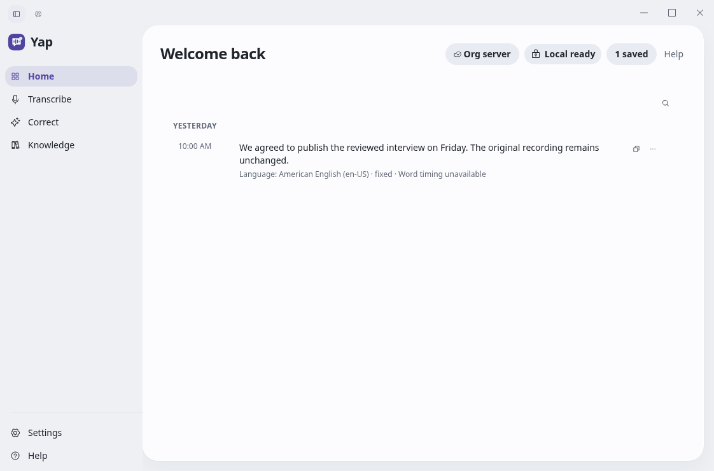

# Yap

**A private workspace for turning recordings into text you can use.**

Bring an interview, meeting or field recording. Queue it, review the transcript,
save corrections, and carry the useful parts into your work. Yap keeps the
original recording and transcript alongside what you change.

Built by **Grant McNatt** with Tauri, React and Rust.

[Get started](#get-started) · [Product](PRODUCT.md) · [Documentation](docs/README.md) · [Current status](docs/CURRENT-STATUS.md)



*Browser preview of the refreshed interface, using synthetic records. See the
[design review](docs/evidence/design-refresh/2026-10-03/review.md) for screens,
references and motion checks.*

## From recording to working knowledge

- **Bring your recordings.** Import files into a durable queue with progress,
  cancellation and retry. Work resumes through the configured organization server.
- **Read, correct and keep the original.** Find saved transcripts, copy or export
  text, and save corrections as separate revisions. Accepted corrections can be
  reopened and exported offline.
- **Follow the sources.** Search your organization's knowledge, explore cited
  connections, and inspect proposals with their exact source excerpts. Publishing
  knowledge remains an explicit human review step.
- **Dictate on your device.** Start an explicit local session with an installed
  model. The compact top-edge island keeps recording controls close at hand.

Imported recordings use an **organization-owned server**. Local dictation runs on
your device. Connecting and signing in are explicit; an outage keeps imports
queued and leaves saved reading and local controls available.

## Where the project stands

Yap is in active development. UI journeys, native boundaries, file preparation and
database workflows can be tested without model hardware. Actual transcription
quality, Windows behavior and enterprise deployment still require qualification
in their intended environments. [Current status](docs/CURRENT-STATUS.md) records
the checks and remaining work.

Current import support covers WAV, MP3, FLAC, Ogg Vorbis, and **M4A/MP4 with one
mono/stereo AAC-LC audio track**. Video in a supported MP4 is ignored. Container
and codec restrictions are documented in [Product](PRODUCT.md); AAC distribution
patent clearance remains a release decision.

Our [single project goal](docs/plans/active/2026-10-02-yap-project-hill-climb.md)
is to finish the full product through working, verified increments. The
[roadmap](docs/roadmap/ROADMAP.md) preserves the complete feature inventory,
including formats, speaker workflows, richer exports and the Voice OS direction.

## Get started

### Preview the interface

Use **Node 24** and **pnpm 11.7.0**. From the repository root:

```bash
cd desktop
pnpm install --frozen-lockfile
pnpm dev
```

Open the local address printed by Vite. This is a browser preview: recording,
native file access and organization sign-in need the desktop app. Inference needs
the corresponding model or configured server.

### Develop the desktop and server

The native stack uses Rust 1.96; server development uses Python 3.12 and uv.
Windows automation requires PowerShell Core 7.4 or newer.

On the managed Debian 13 cloud workspace, the setup script installs the remaining
tools and locked dependencies:

```bash
bash verification/setup-cloud-dev.sh
source verification/cloud-env.sh
pnpm --dir desktop test
pnpm --dir desktop build
pnpm --dir desktop test:e2e
```

The [cloud guide](docs/runbooks/cloud-development.md) covers native builds,
local PostgreSQL and server checks. Start with [desktop development](desktop/README.md)
for Windows or [server development](server/README.md) for service configuration.
These development checks do not need a GPU or model weights.

## Find your way around

| Area | What lives here |
| --- | --- |
| [`desktop/`](desktop/README.md) | The interface, native client and desktop tests |
| [`server/`](server/README.md) | Transcription and knowledge services, contracts and orchestration |
| `infra/` | Private-server deployment and service supervision |
| `verification/` | Development checks and release qualification |
| [`docs/`](docs/README.md) | Setup guides, architecture, decisions and evidence |

For the wider picture, read [Design](DESIGN.md), the
[current architecture](docs/architecture/CURRENT-ARCHITECTURE.md) and the
[Voice OS direction](docs/VOICE-OS-ARCHITECTURE.md). [Security](docs/security/SECURITY-POSTURE.md),
[third-party provenance](docs/provenance/THIRD-PARTY.md) and the
[changelog](CHANGELOG.md) have their own records.
