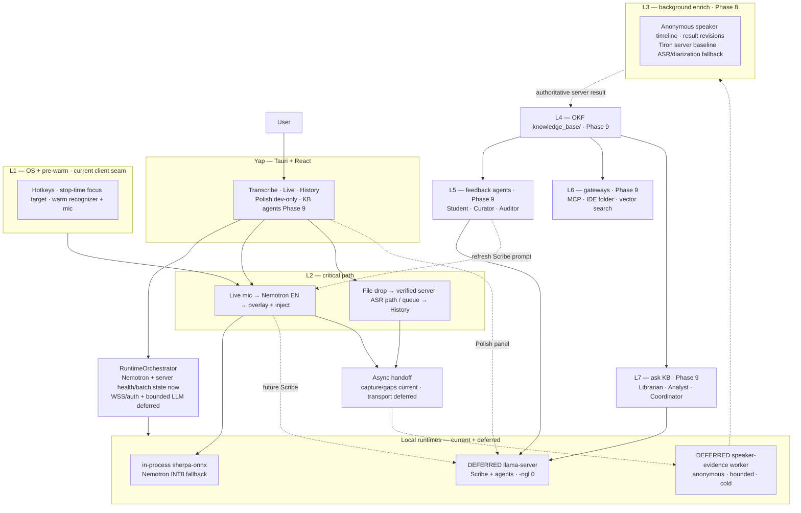
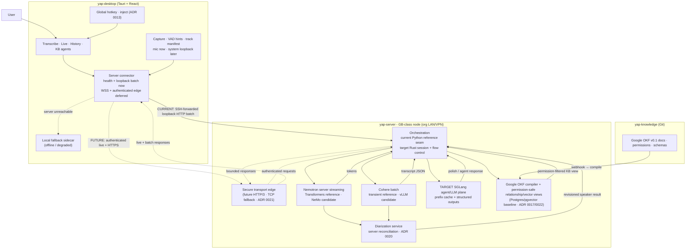
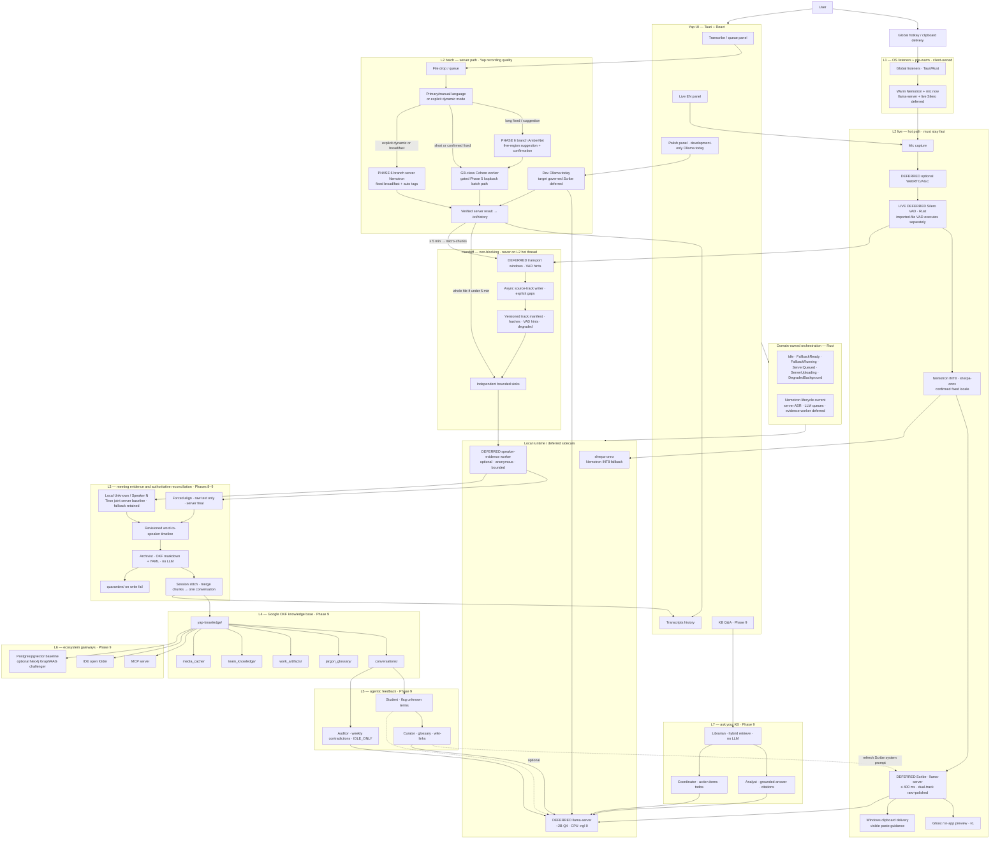
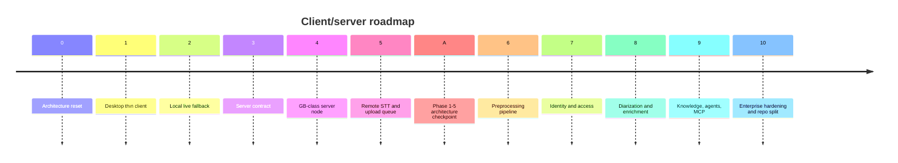

# Yap & Voice OS — System Architecture

**Status:** Living long-term Voice OS frame of reference; implementation-status
snapshot last reconciled 2026-07-24

> **Scope notice (2026-07-15):** This document remains the first-class readable
> frame for the eventual Voice OS architecture. It intentionally combines the
> full-system target, sequencing rationale, and reconciled decisions. Use
> [current architecture](architecture/CURRENT-ARCHITECTURE.md),
> [current status](CURRENT-STATUS.md), and the
> [roadmap](roadmap/ROADMAP.md) for what executes now and what is actively
> scheduled. Substantive changes to this long-term frame require explicit owner
> review; checkpoint cleanup may repair classification and links but must not
> silently redefine the target.

**Authority:** Decisions are normative according to status in [ADR 0001–0027](adr/README.md). This doc is the readable synthesis of the full Voice OS flowchart + reconciled Yap decisions.

For implementation truth rather than decision intent, use the living [ADR implementation status audit](ADR-IMPLEMENTATION-STATUS.md). An accepted ADR or a documented flowchart node is not proof that its code exists.

> **2026-07-08 — Local model reset:** Yap keeps one local live/offline fallback model: Nemotron 3.5 ASR Streaming 0.6B INT8 through in-process `sherpa-onnx`. Client-side fusion routing is rejected; model routing belongs on the server.

> **ADR precedence:** ADR 0014-0027 define the current thin-client, server, local-fallback, meeting-processing, transport-evolution, knowledge-projection, bounded-priority, Phase 6 language/timing, provider-specific serving, batch-language preflight, and Phase 8 joint meeting-ASR direction. ADR 0020 supersedes conflicting diarization details in ADR 0004 and ADR 0015. ADR 0021 makes HTTP/3 a gated future secure-edge target without changing the bounded Phase 3 loopback service. ADR 0022 adopts pinned Google OKF v0.1, requires a permission-safe Postgres/pgvector plus typed-relationship baseline, and makes Neo4j an optional benchmark-gated challenger; no database becomes the knowledge or authorization source-of-truth. ADR 0023 amends absolute live priority so ready batch work cannot starve. ADR 0024 defines primary-language, guarded language, server Nemotron auto, and fail-closed timing behavior. ADR 0025 retires the universal Triton ASR plane in favor of provider-specific vLLM/NeMo serving. ADR 0026 replaces the executing SpeechBrain batch preflight with one verify-only AmberNet artifact and a strict five-region, user-confirmed decision. ADR 0027 selects pinned Tiron as the Phase 8 server development baseline for joint speaker-attributed meeting transcription without promoting it before independent evidence. SGLang remains for compatible agent/LLM inference, and Rust remains the orchestration target. The desktop owns capture, deterministic preprocessing, recording, hotkey/UI, local live fallback, optional anonymous speaker evidence, and future transport packaging. The server owns official long-recording STT, authoritative meeting reconciliation, purpose-authorized named identity, team storage, KB compilation, and agent workloads.

---

## Is this a good idea?

**Yes — if you build it in phases.** The architecture is sound engineering; the main risk is building the whole “Voice OS” before Yap reliably transcribes files.

### Why it’s a good idea

| Principle | Why it works |
|-----------|--------------|
| **Local-first (solo profile)** | Offline, privacy-max; no cloud STT lock-in for individual users. |
| **On-prem GPU (team profile)** | The GB-class server node is org-owned hardware on an org-controlled LAN — "our hardware, our network." Not cloud. Moving batch work off the client is promising, but GB10 wall time and safe concurrency remain benchmark gates. |
| **Critical path isolation** | Live stays fast; heavy work (diarization, OKF, agents) never blocks typing. |
| **Right model per job** | Nemotron INT8 for local live/offline fallback; server router for official recordings/live; **LLM pool** for polish/agents — not one model for everything. |
| **Revisioned diarization** | Local results may use anonymous `Unknown` and `Speaker N`; server reconciliation may refine boundaries and attach purpose-authorized names. |
| **Model-independent meeting authority** | Existing `sherpa-onnx` APIs provide the first local anonymous baseline; Tiron is the selected Phase 8 server development baseline, while Yap contracts and frozen messy-meeting evidence still control promotion and replacement. The released Tiron route is capped at eight window-local and eight global identities; larger speaking rosters require a separately qualified Yap speaker-epoch reconciler or fallback. |
| **Graceful degradation** | Dual-track Scribe, quarantine folder, RAG confidence gates, offline fallback to local sidecar — production-minded. |
| **Recordings as moat** | Journalists/researchers already have files; Cohere batch (GPU-accelerated in team profile) is differentiated vs pure dictation apps. |

### Where it can go wrong

| Risk | Mitigation (in ADRs) |
|------|----------------------|
| **Scope creep** | Ship desktop history/playback → local live fallback → server STT → preprocessing → diarization → L3 OKF in that order. |
| **Target local runtimes** | Today only the in-process sherpa live recognizer exists. If the deferred solo LLM and evidence workers ship, keep their lifecycle bounded and release them by measured idle/resource policy. |
| **Local ASR dependency** | Pin artifacts; verify hashes; profile chunk/latency; CI smoke tests. |
| **Wispr comparison on v1** | Keep hotkeys and safe cross-app delivery client-owned and regression-tested; use clipboard delivery today, and require proof of exact-field authority before any future direct insertion. |
| **OKF/agents before core STT** | Transcripts history first; OKF Phase 9. |

### Verdict

- **Yap (batch + live EN + polish):** Strong product — ship this.
- **Source-aware meeting diarization:** Good idea for meetings/interviews - canonical Phase 8 after track/timeline contracts are stable; never block dictation on it.
- **Full agentic KB + MCP:** Ambitious second product layer — good *direction*, don’t block the live dictation path on it.

---

## What Yap is today vs where we’re going

| | **Current + next Yap boundary** | **Voice OS (long-term)** |
|--|---------------------|---------------------------|
| Primary input | File imports + explicit live mic + global dictation hotkey; paste-last is optional and imports remain a queue shell | Same client inputs plus future connected server routes |
| Live language | Executing fallback applies the confirmed primary locale across Nemotron's exact 32 out-of-box locales. The Phase 6 branch implements one optional bounded resident acoustic-LID component, offline switching, and within-utterance source-time language spans under the same Rust live-runtime owner. Exact candidate `a92f338546a2f8bbaded96b04f8987f0ac475c88` passed the no-server target-client channel and the complete Phase 6 matrix: 12/12 paced native cycles and all nine short-boundary cases completed without drops; the unattended release-mode UI run proved local fallback, cancellation recovery, save/delete, production quit, and complete teardown. The consumed representative natural-switch target failed, so the feature remains explicit, default-off Preview behavior. Longer physical-device and low-end battery/thermal certification remains default-on or Phase 10 work. | Multilingual server live follows the authenticated live-transport gate. Local switching remains a best-effort Preview unless new independently frozen evidence justifies a stronger quality tier. |
| Batch language | Executing Phase 5: Cohere **14 languages**, explicit choice. The unpromoted Phase 6 branch adds the tiered catalog, guarded suggestions, explicit server Nemotron auto mode, and immutable per-segment label corrections under focused tests | Versioned model-agnostic catalog with per-segment provenance and append-only review revisions |
| STT runtime | **Nemotron INT8 sherpa fallback** + gated Phase 5 loopback batch path; WSS/authenticated production transport deferred | Same client shell; heavier pools move server-side |
| Polish | Development-only Ollama call today; bundled `llama-server` is deferred | Scribe + agents through a governed client/server LLM boundary |
| Speakers | Plain dictation; optional anonymous meeting labels later | Revisioned diarization + purpose-authorized server identity + OKF |
| Knowledge | Transcripts history (solo) / `yap-knowledge` Google OKF + compiler (team) | Permission-safe OKF graph/vector views + glossary agents + Q&A |

---

## Two deployment profiles

| Attribute | **Solo / fallback** | **Team / server** |
|-----------|------------------------|-------------------|
| Target | Individual users with local live fallback | Org teams on a shared GB-class server node |
| STT (live) | Local Nemotron INT8 (`sherpa-onnx`) | Server streaming ASR pool (WSS) |
| STT (batch) | Queue/block when offline; official larger recordings use the server path | Current Cohere batch route plus evidence-gated Cohere/vLLM and Nemotron/NeMo candidates |
| LLM | No shipped local LLM; development Polish currently calls Ollama | Future server LLM pool (GPU, multi-tenant) |
| Diarization | Optional local `Unknown` / `Speaker N`; no durable profiles | Tiron joint speaker-attributed development baseline plus ASR/diarization fallback; server-authoritative reconciliation and evidence-gated promotion (ADR 0020/0027) |
| Identity | Per-transcript contact labels only; no biometric matching | Entra ID / MSAL + explicit voice enrollment (ADR 0016/0020) |
| Knowledge base | Future Google OKF Markdown with local SQLite retrieval | Future `yap-knowledge` Git + deterministic compiler + Postgres permissions/relationships + pgvector baseline; optional Neo4j challenger (Phase 9, ADR 0017/0022) |
| Network | None required for live fallback; server required for official recordings | LAN/VPN to the GB-class server node; future HTTP/3 secure edge with HTTP/2 or HTTP/1.1 fallback |

The **client shell** (`yap-desktop`) is identical in both profiles. Mic capture, track-aware preparation, explicit gaps, bounded sink fan-out, streaming recording, hotkey, overlay UI, local Nemotron fallback, durable imported-job ownership, and connector health/capability/retry state are implemented. The merged Phase 5 path adds strict admission and extraction of already-canonical mono PCM16/16 kHz WAV input, durable loopback HTTP batch upload/drain, cancellation, verified result publication, and History projection; its one-time complete local/native/server/GB10 gate and hosted exact-head checks passed before merge. General media decoding/resampling, Opus, WSS/live, authentication, persistent service deployment, and external application networking remain deferred. Server unavailability queues or blocks larger recordings instead of silently producing official-looking transcripts from the fallback.

The on-prem GB-class server node is **org-owned hardware on an org-controlled LAN** — not a public cloud service. The current profile is DGX Spark GB10; a future GB300-class node should be a capacity/profile change, not a product architecture change. This is consistent with the "no cloud STT" principle for regulated/clinical orgs.

Details: [ADR 0014](adr/0014-server-tier-compute-topology.md) (topology) · [ADR 0020](adr/0020-meeting-capture-diarization-authority.md) (meeting capture and diarization) · [ADR 0027](adr/0027-tiron-joint-speaker-attributed-meeting-transcription.md) (Tiron server meeting baseline) · [ADR 0016](adr/0016-auth-identity-bridge.md) (auth and purpose-authorized identity) · [ADR 0017](adr/0017-knowledge-base-compiler.md) (KB compiler) · [ADR 0018](adr/0018-three-repo-topology.md) (repos) · [ADR 0021](adr/0021-http3-secure-edge-transport.md) (gated HTTP/3 edge) · [ADR 0022](adr/0022-google-okf-permission-safe-projections.md) (Google OKF and permission-safe graph/vector views) · [ADR 0023](adr/0023-bounded-live-priority.md) (bounded live preference) · [ADR 0024](adr/0024-global-language-routing.md) (Phase 6 language/provider/timing boundary) · [ADR 0025](adr/0025-provider-specific-asr-serving.md) (provider-specific ASR serving)

---

## Core decisions (summary)

1. **Recordings → a verified server ASR route** (current narrow Cohere baseline;
   select Cohere or Nemotron only by locale- and workload-specific evidence).
2. **Live mic / offline fallback → Nemotron INT8** (confirmed supported primary
   locale; no implicit auto mode).
3. **One warm local sherpa recognizer**; server router owns heavier model residency.
4. **Language decision** = confirmed primary/manual language for short fixed work, bounded verify-only AmberNet suggestion for longer fixed recordings, or an explicit Nemotron auto mode; never silent provider switching.
5. **Meeting enrichment** = independent bounded sinks and revisioned results; never block dictation.
6. **Meeting speakers** = local anonymous evidence when available; pinned Tiron joint speaker-attributed server baseline with ASR/diarization fallback; server-authoritative reconciliation and purpose-authorized names.
7. **Align raw STT**, never polished LLM text, before word→speaker intersection.
8. **On-prem GPU** = "our hardware, our network" — not cloud; extends local-first trust to the org's LAN (team profile).
9. **Auth** = Entra ID / MSAL; `(tid, oid)` principal key; Yap API audience validation; explicit consent before any durable voice profile.
10. **KB compiler** = pinned Google OKF/Git source-of-truth + deterministic compile → Postgres permission/relationship ledger + pgvector baseline + optional Redis; Neo4j must earn promotion.
11. **Transport evolution** = bounded loopback service now; authenticated HTTP/3 secure edge later, with TCP fallback and benchmark gates.

Details: [ADR 0001](adr/0001-dual-stt-backends.md) · [0002](adr/0002-crispasr-unified-stt-runtime.md) · [0003](adr/0003-long-term-voice-architecture.md) · [0004](adr/0004-background-diarization-okf-agents.md) · [0005](adr/0005-llama-server-agents.md) · [0006](adr/0006-silero-agents-state-machine.md) · [0014](adr/0014-server-tier-compute-topology.md) · [0016](adr/0016-auth-identity-bridge.md) · [0017](adr/0017-knowledge-base-compiler.md) · [0018](adr/0018-three-repo-topology.md) · [0019](adr/0019-local-streaming-model-selection.md) · [0020](adr/0020-meeting-capture-diarization-authority.md) · [0021](adr/0021-http3-secure-edge-transport.md) · [0022](adr/0022-google-okf-permission-safe-projections.md) · [0023](adr/0023-bounded-live-priority.md) · [0024](adr/0024-global-language-routing.md) · [0025](adr/0025-provider-specific-asr-serving.md) · [0027](adr/0027-tiron-joint-speaker-attributed-meeting-transcription.md)

---

## Pipeline charts

Two views of the same target architecture - **high-level** for orientation, **low-level** for implementation. They include deferred components so each future boundary has a home; a node is current only when its label or the implementation-status sections below say so. Normative rules live in [ADR 0001–0025](adr/README.md); sections below expand each box.

**Target read order:** UI → **RuntimeOrchestrator** → local fallback or server connector. **L3** never blocks L2. If the deferred local LLM product is activated, **Polish** and **Scribe** share **llama-server** via the mutex rules in [ADR 0006](adr/0006-silero-agents-state-machine.md). Today Polish is a development-only Ollama call and Scribe/llama-server are absent.

### High-level overview

Current and deferred layers, dual inputs, and async handoff — no per-node detail.



Imported and official recording jobs never run through local Nemotron. When the server is unavailable they remain queued or blocked; "offline" describes connectivity, not a local file-transcription mode.

### Team / server profile — high-level

Thin client shell + GB-class server node. The client connector owns validated
health/capability/retry state and, in the Phase 5 development profile, durable
batch create/upload/commit/status/result/cancel through an explicitly approved
loopback origin. That gated path connects the Phase 4 router/pool and isolated
Cohere worker without exposing an application port: Windows reaches server
loopback only through a manually selected SSH forward. WSS/live, application
authentication, persistent supervision, and the managed enterprise edge remain
deferred. The accepted performance topology is provider-specific: Cohere batch
uses a digest-pinned vLLM candidate, Nemotron keeps a Transformers correctness
reference and evaluates NeMo for server streaming, SGLang serves later
agent/LLM workloads, and Rust remains the orchestration target. The vLLM
adapter/image/loopback launcher and the resident NeMo worker/service/image/
launcher execute under focused tests but remain unselected until their separate
frozen GB10 lifecycle and workload gates. Both foreground launchers require an
exact-head internal Docker bridge and separate API keys, publish no Docker
port, and own a bounded process group that exposes only numeric host loopback.
  A checked wrapper composes their plan-owned lifecycle cells sequentially and
  removes its temporary bridge before final evidence. Exact-head lifecycle
  results and their current disposition are recorded in
  [current status](CURRENT-STATUS.md); candidate-safety evidence does not itself
  promote a provider. The NeMo implementation currently
serves bounded finalized jobs; it is not the deferred client-facing live
transport. Focused repeated-fixture controls reached the exact four-hour
boundary through both provider adapters with bounded result publication and
clean teardown, but do not establish long-form quality, sentinel continuity,
frozen latency percentiles, or production capacity. The NeMo service advances
the streaming checkpoint in 1.12-second cache-aware frames but currently emits
only the finalized result, so its focused long-file wall time is not evidence of
a client-facing streaming experience. Long-form offline throughput and future
partial-result latency remain separate decisions. Yap submits one offline vLLM
API request, but vLLM may schedule multiple bounded engine chunks internally;
its engine histograms and Yap's API wall latency remain separate units. The
vLLM scheduler's eight-sequence limit can queue work and is not treated as an
HTTP rejection contract. Yap's batch pool owns the executable 8-running +
8-queued and aggregate four-hour PCM admission limit; NeMo separately owns an
authenticated eight-active service boundary with typed ninth-request 429.
Cancellation, capacity, and fixed/automatic NeMo contracts use distinct private
qualification runners so a completion total cannot substitute for the named
behavior. The NeMo request-lifecycle cell gates on both valid language contracts
while reporting lexical and rendered-text parity separately; vLLM
cancellation distinguishes its pinned externally freed request accounting from
provider completion. Provider-behavior promotion cells retain lexical stability
and independent punctuation-quality scoring. These mechanics are implemented;
the model-neutral candidate-safety GB10 lifecycle passed again at exact candidate
`a92f338546a2f8bbaded96b04f8987f0ac475c88`, while comparative behavior and
candidate promotion remain Phase 8 work. The
retired Triton experiment
remains historical negative evidence rather than an accepted topology. See
[ADR 0014](adr/0014-server-tier-compute-topology.md) and
[ADR 0025](adr/0025-provider-specific-asr-serving.md).

Local deterministic duration replay uses the same bounded desktop ASR adapter,
single live worker, and finalization path as capture after audio has become a
prepared frame. The runner streams rather than retaining multi-hour WAVs and
binds the exact head, machine plan, external private suite, manifests, raw WAV,
and decoded PCM while emitting no transcript or path. Its declared boundary is
therefore `desktop-prepared-audio-frame-to-final`. The separate current-host
default-microphone/rendered-UI/resource gate passed at exact candidate
`a92f338546a2f8bbaded96b04f8987f0ac475c88`; natural short-correction quality
remains later selected-model evidence and is not inferred from the runner.

The resource boundary follows the same provider-specific rule. Runtime-plan
schema 5 freezes separate c8/1,600 GB10 current/peak, allocation-extent,
task/thread, and memory-event ceilings for vLLM and NeMo. NeMo reports CUDA
allocation/reservation per completed request and reuses bounded HTTP workers;
its separate model scheduler still owns at most eight active streams. Physical
RSS residency/reclaim oscillation on unified-memory GB10 remains reported, while
tail virtual allocation growth is the boundedness gate. The resource-lifecycle
scope records transcript variance without turning that resource measurement
into provider-promotion evidence, and a minimum 125-second observation window
guarantees at least 60 seconds in its last-half tail. These thresholds have
focused evidence and both current-source profiles pass all eleven resource
checks plus clean teardown, but neither has passed the one-time checked-head
matrix.



### Low-level target detail — 7 layers

Full Voice OS target flowchart reconciled for Yap — **live + batch**, orchestrator, local runtimes, manifests, and canonical Phases 8–9 enrichment. Arrows show intended flow, not landed integration; deferred nodes are labeled directly.



**Meeting transport:** bounded windows may align to VAD boundaries but never grow without bound. Full retained source audio remains available for authoritative reprocessing; client VAD is advisory ([ADR 0020](adr/0020-meeting-capture-diarization-authority.md)).

**Transport evolution:** the Phase 3 application stays on bounded loopback HTTP/1.1. After the remote transport and authentication baselines exist, the client-facing edge may promote HTTP/3 with HTTP/2 or HTTP/1.1 fallback. WSS over HTTP/3 and a supported WebTransport candidate must be benchmarked against the authenticated WSS baseline before promotion ([ADR 0021](adr/0021-http3-secure-edge-transport.md)).

---

## Decision-coverage matrix

Everything from the original 7-layer flowchart and master spec is represented below. **Reconciled** items differ from the original diagram on purpose (ADRs override). The checkmark means the decision is documented, not implemented; current implementation scores live in [ADR-IMPLEMENTATION-STATUS.md](ADR-IMPLEMENTATION-STATUS.md).

| Original flowchart node | Decision documented? | Where | Yap decision (if changed) |
|-------------------------|-------------|-------|---------------------------|
| **L1** Global OS listeners | ✅ | ADR 0013 | Tauri hotkeys, bounded native physical-chord enrollment, and Windows clipboard delivery are active; other platforms follow |
| **L1** Pre-warm (llama.cpp KV, mic, Silero) | ✅ | ADR 0002, 0005, 0019 | Warm **Nemotron recognizer** is implemented; llama-server and live-microphone Silero are deferred |
| **L2** Mic, WebRTC/AGC clean | ✅ | § L2 | Capture foundation is implemented; AGC and live-microphone Silero are deferred |
| **L2** VAD | ✅ Reconciled | Local audio spec, ADR 0006/0020/0024 | Imported canonical WAV advisory Silero VAD executes with complete source retention; live endpointing remains deferred |
| **L2** Batch LangID | ✅ Reconciled | ADR 0003/0008/0024/0026 | **Off the live hot path**; the Phase 6 branch verifies one imported AmberNet 1.12.0 INT8 QDQ artifact and samples five strict six-second regions from start through exact tail before explicit user confirmation. Focused real-model/parity/contract tests and source-exact ARM64 resource/lifecycle evidence exist; exact candidate `a92f338546a2f8bbaded96b04f8987f0ac475c88` passed the portable Python, Rust, connected-route, and complete Phase 6 matrix. Representative suggestion quality remains unpromoted. The prior SpeechBrain receipt is historical. |
| **L2** ASR | ✅ Reconciled | ADR 0001–0002/0014/0019/0024/0025 | **Nemotron local fallback**; **server router** for official recordings/live; explicit server Nemotron auto mode and provider-specific vLLM/NeMo candidate-safety gates execute, while broad provider promotion and Cohere-versus-Tiron selection belong to Phase 8 |
| **L2** Post-LLM (Llama 3 8B) | ✅ Reconciled | ADR 0005 | Deferred **llama-server** target; current development Polish uses Ollama |
| **L2** Ghost preview | ✅ | § L2 | In-app panel v1 |
| **L2** Cross-app delivery | ✅ | ADR 0013 + `live/injection.rs` | Copy the completed transcript with a Yap-owned Windows clipboard operation and show visible paste guidance; synthesized input is disabled |
| **L2** Bounded track handoff | ✅ Reconciled | Local audio spec, ADR 0020 | Independent sinks, content identity, and explicit gaps |
| **L3** Handoff audio + raw text | ✅ Reconciled | ADR 0020 | Versioned source tracks and immutable raw artifacts |
| **L3** Forced alignment | ✅ Reconciled | ADR 0007, ADR 0020, ADR 0024 | Align raw text only; enable by measured provider/language capability and fail closed when unavailable |
| **L3** Anonymous local speaker evidence | ✅ Reconciled | ADR 0020 | Contracts permit `Unknown` / `Speaker N`; no production speaker model is wired |
| **L3** Server diarization + identity | ✅ Reconciled | ADR 0016, ADR 0020 | Revisioned reconciliation; names require active purpose grants and provenance |
| **L3** Word-to-speaker timeline | ✅ Reconciled | ADR 0020 | Model-derived boundaries with result revision and confidence |
| **L3** OKF parser | ✅ | ADR 0004 §6 | Phase 9 |
| **L3** Worker isolation | ✅ Reconciled | ADR 0020 | Optional client evidence and server reconciliation are independent from capture/ASR |
| **L4** knowledge_base dirs | ✅ | § Process layout | + `team_knowledge/` in long-term OKF |
| **L5** Student, Curator, Watcher loop | ✅ | § Agents | Three-strike + git opt-in |
| **L5** Auditor | ✅ | § Agents | Weekly cron; Phase 9 |
| **L5** Rewriter → Post prompt cache | ✅ | § Agents | Updates Scribe system prompt |
| **L6** IDE, MCP, VectorDB | ✅ | Phase 9 | Open-folder KB |
| **L7** Librarian, Analyst, Coordinator | ✅ | § Agents | RAG + citations + todos |
| **Failure states** (Scribe, Archivist, …) | ✅ | § Failure states | Full spec below |
| **Bottleneck / resource caps** | ✅ | § Resource profiling | Bounded sinks, bounded session clusters, benchmarked CPU/RSS/latency gates |
| **Silero VAD (L2 + segments → L3)** | ✅ | [ADR 0006](adr/0006-silero-agents-state-machine.md) | Imported-file path executes through pinned `sherpa-onnx`; live path remains a separate target; reprocessing may re-VAD retained source |
| **Agent profiles (8 personas)** | ✅ | [ADR 0006](adr/0006-silero-agents-state-machine.md) | Mutex groups; v1 = Scribe only |
| **Runtime state machine** | ✅ | [ADR 0006](adr/0006-silero-agents-state-machine.md) | One client-local Nemotron session; server pools schedule independently; bounded LLM queue |
| **16 GB RAM budget** | ✅ Reconciled | ADR 0020 | No diarization model is promoted without measured CPU, RSS, and latency evidence |
| **Recordings / file drop (Yap)** | ✅ | ADR 0001, 0003, 0014 | Server batch only; queue/block during disconnects; never use local Nemotron |

Rows marked as future remain architecture-only. The Windows hotkey/clipboard-delivery path, local live fallback, Nemotron-gated source-aware microphone capture, bounded recording/local-ASR fan-out, native recording-file admission, and durable recording/recovery path are implemented client behavior. Bounded evidence and transport ports exist, but their production consumers are not wired.

---

## Layer model (7 layers)

| Layer | Name | Yap phase | Role |
|-------|------|-----------|------|
| **L1** | OS listeners + pre-warm | Current client | Hotkeys, clipboard delivery, warm recognizer/mic |
| **L2** | Real-time critical path | Current + follow-on | Nemotron → UI/copy now; optional Scribe later |
| **L3** | Async background | 8–9 | Align, diarize, stitch, OKF |
| **L4** | Google OKF knowledge base | 9 | Markdown/YAML concepts, typed Yap relationships, Git history, permission-safe projections |
| **L5** | Agentic feedback | 9 | Student, Curator, Auditor |
| **L6** | Ecosystem gateways | 9 | MCP, vector search, IDE folder |
| **L7** | Ask-your-KB agent | 9 | Librarian + Analyst |

---

## Real-time path (L2) — implemented baseline

```
Nemotron INT8 startup (required before current production capture)
Mic → bounded capture/preprocess → Nemotron INT8 (sherpa-onnx)
  → partial/final state → overlay
  → Windows clipboard delivery with Yap HWND ownership
  → visible manual-paste status; no synthesized input
  → track-aware prepared frames + exact gaps
      → independent bounded recording + local-ASR consumers
      → bounded evidence + transport ports (production consumers not wired)
      → streaming WAV + immutable capture sidecar/commit
      → hash-validated history, partial recovery, and deletion
```

### Target fan-out beyond the implemented baseline

The following includes deferred components. Today the production coordinator
wires recording and local Nemotron ASR. The active Phase 6 imported-file path
prepares and drains durable loopback batch jobs and can run explicitly installed
Silero over canonical WAV as advisory source-time evidence. It does not run live
Silero, llama-server/Scribe, speaker inference, WSS/live transport, a promoted
Nemotron NeMo live route, or SGLang. Cohere vLLM and resident NeMo adapters are
gated development candidates rather than promoted persistent services.

```
Mic → optional AGC → Silero VAD                         [deferred]
  → Nemotron INT8 (sherpa-onnx, confirmed primary locale) ← live tokens
  → llama-server polish (Scribe) if <400ms budget   [deferred]
  → ghost UI + clipboard delivery (Windows)        ← direct field insertion deferred

Parallel (never blocks above):
  prepared microphone frames + explicit gaps
    → recording sink
    → optional anonymous speaker-evidence sink
    → future retryable server-transport sink
```

The production coordinator currently supplies recording and local-ASR consumers; `speaker_evidence` and `server_transport` are `None`. The coordinator contract lets recording fail or finalize independently of ASR, but the user-facing production start path does not yet capture without first constructing the Nemotron stream and local-ASR adapter.

**Not on the L2 hot thread:** official server ASR, language ID, speaker inference, alignment, reconciliation, identity matching, and OKF.

---

## Background path (L3) — hardened

### Conceptual future server chunk payload

This snake_case example is explanatory server-contract material, not the current Rust serialization. The implemented client contracts serialize camelCase fields and include nested replay/content identity and revision information. The machine-readable Phase 3 contract must be generated from or tested against those current types rather than copying this example.

```json
{
  "schema_version": 1,
  "chunk_id": "...",
  "owner_namespace": "local:<install-id>",
  "session_id": "...",
  "track_id": "mic-0",
  "track_source": { "kind": "captured", "source": "microphone" },
  "sequence_start": 0,
  "sequence_end": 319,
  "start_ms": 0,
  "duration_ms": 32000,
  "sample_rate_hz": 16000,
  "codec": "pcm_s16le",
  "content_sha256": "...",
  "audio_artifact_id": "...",
  "session_mode": "dictation|meeting",
  "session_origin": "live_capture|imported_file",
  "vad_segments": [[1200, 3400]],
  "gaps": [],
  "route": "local_fallback|server_live|server_batch",
  "degraded": false
}
```

For an import, `track_source` is `{ "kind": "imported", "provenance": "unknown|mixed|user_declared" }` with an optional declared source. The local owner namespace prevents collisions on one installation; when a chunk crosses the server boundary, the server replaces it with the token-derived `(tenant_id, owner_subject_id)` and never trusts a client-supplied tenant owner.

Raw/polished text, language, and speaker attribution are not capture-manifest fields. Each belongs to a separate immutable result revision that references the capture or chunk hash, so reprocessing cannot mutate capture history.

### Timestamped speaker result (separate revision)

```json
{
  "session_id": "...",
  "revision": 3,
  "authority": "server_authoritative",
  "created_at_utc": "2026-07-10T12:00:00Z",
  "capture_manifest_sha256": "...",
  "status": "complete|partial",
  "language": { "tag": "en-US", "confidence": 0.98 },
  "speaker_turns": [
    { "turn_id": "t1", "start_ms": 1200, "end_ms": 3400, "speaker": "speaker-1", "confidence": 0.94 }
  ],
  "aligned_words": [
    { "index": 0, "text": "Hello", "start_ms": 1280, "end_ms": 1640, "turn_id": "t1", "speaker": "speaker-1" }
  ]
}
```

All intervals are end-exclusive on the monotonic session timeline. Speaker turns may overlap. Segment timestamps exist independently of word alignment; alignment adds word-level timestamps and speaker intersection later.

### Processing per chunk

1. **Validate** schema, session, track, timing, content identity, and gaps.
2. **Preserve** raw audio and raw text as immutable inputs.
3. **Project local evidence** to `Unknown` or session-scoped `Speaker N` when the optional client path is available.
4. **Reconcile on the server** from retained source audio; use the pinned Tiron joint speaker-attributed baseline first, retain the ASR/diarization fallback, align raw text when separately validated, and publish a new result revision.
5. **Attach names only** through purpose-authorized, tenant-scoped profiles with model and calibration provenance.

### Back-pressure

- Every sink is bounded and reports its own degraded state.
- Recording has priority over optional ASR, evidence, and transport work.
- Exceeding the local speaker safety ceiling yields `Unknown` plus a server-reprocessing marker.
- Thread counts, queue depths, and idle policy are measured runtime configuration, not fixed architecture constants.

### Batch recordings

- Imported files retain a whole-file artifact and may use bounded processing windows.
- Live meetings retain source tracks and may use bounded transport windows aligned to VAD hints.

---

## Agents & failure modes

### Agent roster (8 personas)

Scoped profiles, mutex groups, and state rules: **[ADR 0006](adr/0006-silero-agents-state-machine.md)**.

| Agent | Layer | Trigger | Job | LLM? |
|-------|-------|---------|-----|------|
| **Scribe** | L2 | Raw STT tokens | Filler strip, grammar, jargon dict | llama-server |
| **Archivist** | L3 | Chunk JSON ready | OKF markdown + YAML frontmatter | No |
| **Student** | L5 | New conversation saved | Flag unknown terms/acronyms | Optional |
| **Curator** | L5 | User defines term | Glossary card, wiki-links, refresh Scribe prompt | llama-server |
| **Auditor** | L5 | Weekly / on bulk edit | Flag contradictions across notes | llama-server |
| **Librarian** | L7 | User query | Hybrid retrieve → context pack | No |
| **Analyst** | L7 | Context pack | Grounded answer + citations | llama-server |
| **Coordinator** | L7 | New transcript | Extract action items → todos | llama-server |

### Failure states (graceful degradation)

| Agent | Risk | Fallback |
|-------|------|----------|
| **Scribe** | Hallucination / over-edit | **Dual-track** raw + polished; undo → raw; **>400ms → raw only** on live |
| **Archivist** | Bad JSON / write fail | **`quarantine/`** — audio + text; worker continues |
| **Student** | Notification spam | **Three-strike rule**; **Ignore forever** blacklist |
| **Curator** | Broken wiki-links | **Opt-in git**; auto-commit before bulk edits; rollback |
| **Auditor** | False conflicts | Non-blocking toast; user dismisses |
| **Librarian** | No good hits | Confidence **<0.60** → do not pass to Analyst |
| **Librarian** | Too many hits (>50) | Pass **5 most recent**; flag “summarize older?” |
| **Analyst** | RAG hallucination | Must cite sources; “no solid notes” template if empty context |
| **Coordinator** | False commitments | **Proposed tasks** vs auto todos by confidence score |

---

## Runtime orchestration (summary)

**Target state-machine limits** — full decision in [ADR 0006](adr/0006-silero-agents-state-machine.md). The implemented Rust domain owners enforce the local Nemotron lifecycle, project connector health/capabilities/retries, and retain durable imported-job plus normalization/VAD stage attempts. The server owns durable ASR/alignment/result-publication attempts and verified result publication. Imported-file Silero executes; live Silero, LLM scheduling, promoted NeMo/SGLang serving, and WSS/live server transport are not wired. The Cohere vLLM and resident NeMo candidates remain behind the existing bounded batch contract:

| Rule | Limit |
|------|--------|
| Local STT loaded | Client fallback loads **Nemotron INT8 only**; server router owns fusion/routing |
| Scribe (HOT) | **1** at a time; **400 ms** max |
| Background LLM agents | **1 queued** (Student, Curator, Analyst, …) |
| Speaker evidence | Optional, bounded, anonymous, and independently degradable |
| Background agents during live | **Blocked** except Scribe |
| Meeting workers | Load only for meeting work; release by measured idle/resource policy |

**VAD:** Runs outside inference ownership and supplies advisory endpointing and
segment hints. The imported canonical-WAV path now executes the exact pinned
Silero artifact through `sherpa-onnx`; missing/corrupt/runtime failure is explicit
and never removes source audio. Live endpointing remains deferred, and later
processing may revise VAD decisions from retained source.

```
Idle ↔ FallbackReady ↔ FallbackRunning  (local Nemotron INT8)
Idle ↔ ServerQueued ↔ ServerUploading   (verified GB-class ASR route)
         client does not load server batch models
```

### Desktop implementation guardrails

These rules prevent the repeated UI and runtime churn we have been seeing. They are part of the architecture contract, not polish notes.

**Current implementation:** the convergence client now keeps one continuously reused `live-overlay`. React projects semantic surfaces and never receives native resize/position permissions; Rust is the sole production bounds owner, top-centers `104×40` collapsed and `180×96` expanded frames, sizes compact status surfaces exactly, and applies a rounded Windows hit region. Show and hover remain non-activating, while explicit focus exposes keyboard-accessible 40 px primary actions. The 200 ms collapse grace keeps the visible target present. Shortcut changes require native confirmation and one bounded 15-second Rust/Windows physical-chord epoch; the recorder waits for neutral/chord/release, ignores ordinary typing without the required modifiers, persists only a normalized chord, and retains reserved/conflict validation, Cancel, per-action Reset, and transactional rollback. Dictation defaults to `Ctrl+Shift+Space`; paste-last defaults to the deliberately less collision-prone `Ctrl+Shift+Alt+V`. Completed transcripts use clipboard-only delivery with visible paste guidance; Yap does not synthesize focused-field input. Remaining client gaps are macOS/Linux hotkey/clipboard adapters, broader real-application clipboard evidence, and optional real-model/hardware lifecycle proof.

| Surface | Do | Do not |
|---------|----|--------|
| Live island geometry | Keep one continuously reused tray-owned island window and one owner for native bounds. Collapsed bounds match the visible island; hover expands the same window downward to match the visible controls. | Do not use a second island window, an oversized transparent click-catcher, or competing Rust/React geometry owners. |
| Live island motion | Keep a visible hover target through the collapse grace period and animate content inside the current native bounds. Test hit testing and focus while the surface is moving. | Do not leave transparent native-window area intercepting clicks or let expansion activate/focus the app. Do not rely only on settled screenshots. |
| Overlay permissions | Give the overlay window only the capabilities it needs for its owner boundary. | Do not grant frontend `set_size`, `set_position`, or monitor permissions if Rust owns geometry. |
| Live transcription process | Prefer one session owner and explicit lifecycle boundaries. Until the sidecar exposes reset/ack/session tags, stale stdout must not be able to enter a new dictation session. | Do not hide clipping or stale-session risk behind warm reuse unless there is a protocol-level ready/reset signal. |
| Recording history | Keep one canonical transcript/review surface and one cache owner. | Do not maintain separate preview dialogs, separate read-through caches, or fake recording adapters for the same transcript row. |
| Settings and controls | Ship usable dictation and paste-last defaults. Enter an explicit "Change shortcut" mode that records one physical primary-key chord, normalizes only that final chord, supports Cancel and Reset, and preserves the previous registration on failure. | Do not require users to type chord strings, accept bare printable/OS-reserved chords, capture outside deliberate recording mode, or log/store raw key events. |
| Docs and code | Update the ADR/spec/product surface in the same phase as the code. | Do not ship behavior that contradicts the client/server split: live local fallback is allowed; official long recordings queue for server. |
| Speaker privacy | Persist anonymous timelines and user labels; keep local embeddings transient. | Do not turn contact import, transcript renaming, or meeting attendance into passive voice enrollment. |
| Server staging | Keep the default Phase 3 health-only profile separate from the Phase 5 loopback batch profile. Advertise batch/status only after private storage, immutable locks, verified models, router, and pool initialize. Keep reference workers transient/networkless; keep Phase 6 resident containers on a temporary exact-head internal bridge with no Docker-published port or egress, and use checked non-root launchers to own bounded numeric-loopback proxy process groups with separate API keys. | Do not advertise live capability, expose a model service beyond host loopback, give the provider containers external egress, or mistake focused resident/concurrency evidence for an authenticated persistent multi-user service or production capacity benchmark. |

---

## Resource profiling (16 GB target)

| Concern | Fix |
|---------|-----|
| CPU thread thrashing | Independent bounded sinks; speaker work stays off the capture/ASR hot thread |
| RAM growth | Session clusters target 32 and stop at the 64-speaker safety ceiling; exemplars remain bounded and transient |
| Live dropouts | Recording is the priority sink; callback loss becomes an explicit timeline gap |
| Short or noisy turns | Under 1.6 seconds is weak evidence; use calibrated score, margin, quality, and cumulative speech rather than a forced match |
| Speaker-label churn | Stable IDs within a result revision; merges, splits, server reconciliation, and user corrections create explicit revisions |
| Queue backlog | The Rust-owned ledger preserves backlog; Phase 5 reconnect drain is bounded, origin-leased, cancellation-first, and resumable |

---

## Language policy

| Mode | Current or accepted language boundary | Detection/decision |
|------|---------------------------------------|--------------------|
| **Local live fallback (executes)** | Pinned `sherpa-onnx` export over the exact 32-locale out-of-box Nemotron allowlist | Warmup requires the confirmed primary locale and applies it to creation/reset; unsupported locales fail visibly. Nemotron's public result exposes no automatic tag, so the optional Phase 6 branch path uses a separately pinned acoustic detector rather than hidden model output |
| **Local live dynamic (executes as a default-off Preview)** | The same single Nemotron ASR plus one bounded resident native acoustic-LID component | `LiveRuntime` owns both lifecycles; LID emits revisioned source-time spans with bounded decision evidence, and confirmed switches partition held source audio exactly once before finalize/reset. Independent detector-history and ASR-commit cursors share source frames without replay. Ambiguity or failure holds/returns visibly to the confirmed primary locale |
| **Fixed batch (executes)** | Cohere 14-language Phase 5 worker plus the unpromoted Phase 6 preflight boundary | One explicit preferred language; recordings meeting the 30-second/speech bounds may run five start-to-tail AmberNet regions, but any disagreement/ambiguity remains manual and the job stays blocked until the user confirms a supported locale |
| **Fixed batch (later promotion target)** | Tiered provider catalog: overlapping Cohere/Nemotron routes plus Nemotron out-of-box locales | Phase 8 or a later explicit provider gate may promote only independently qualified locale/workload routes and make their catalog-derived choices selectable without changing the executing confirmation boundary |
| **Dynamic batch/utterances (executes on the unpromoted Phase 6 branch)** | One server Nemotron job over its enabled 32 out-of-box locales | Explicit `target_lang=auto`; retain one tag per finalized utterance, mark missing/invalid/disabled tags `Unknown`, and do not switch ASR providers inside the job. History corrections are separate strict-schema, hash-chained revisions; they never rewrite source audio or the server result |

The Phase 6 union catalog can represent 33 locale entries across 29 language
families: 32 Nemotron transcription-ready/broad-coverage locales plus Cohere-only
Greek. Quality tier remains visible and is not an enterprise certification.
Nemotron's eight adaptation-ready locales are excluded from its supported path;
Yap has no language fine-tuning plan. Within-utterance language spans execute as
an explicit default-off Preview. Exact candidate
`a92f338546a2f8bbaded96b04f8987f0ac475c88` passed the Phase 6 lifecycle,
continuity, latency, memory, UI, and teardown matrix, while its consumed natural-
switch target failed. Promotion beyond Preview requires new independently frozen
natural/noisy quality and release evidence rather than reinterpretation of that
failure.

A focused exact-source AMI `ES2004a` comparison reinforces the provider-neutral
boundary without promoting a route. On the same 17.49-minute close-headset mix and
far-field channel after production client preprocessing, Nemotron/NeMo produced
lower normalized lexical WER, while Cohere/vLLM completed faster and produced
higher punctuation F1. The public reference is exposure-unknown, known-defective,
flat-ordered across overlap, and not independently reviewed. Consequently the
result rejects a universal accuracy label but cannot select a default or replace
the frozen representative provider gates.

Current Cohere batch codes remain `en`, `fr`, `de`, `it`, `es`, `pt`, `el`,
`nl`, `pl`, `zh`, `ja`, `ko`, `vi`, and `ar`. The versioned server catalog,
not permanent UI source code, will own the Phase 6 provider/locale matrix.

Current UI copy must remain honest until alternate server routes pass their
promotion gates: **“Local fallback: primary language when supported · Server
files: advertised languages.”** Broad-coverage entries must retain a visible
quality tier.

---

## Process & data layout

### Target solo / local-first profile

The in-process sherpa recognizer, explicitly managed Silero and AmberNet model
caches, persisted language preferences, transcripts/history artifacts,
remote-job spool/ledger, connector settings/snapshot, and normal logs exist
today. Entries explicitly marked deferred below remain targets.

```
Yap (Tauri)  [yap-desktop]
  ├─ sherpa recognizer         STT — Nemotron INT8 fallback
  ├─ AmberNet detector         optional resident INT8 QDQ acoustic LID
  ├─ llama-server sidecar      [deferred] Polish + LLM agents (CPU -ngl 0)
  └─ speaker-evidence worker   [deferred] anonymous meeting labels; no durable identity

%APPDATA%/com.mcnatg1.yap/     Tauri app_data_dir on Windows
  models/                      pinned model cache
    silero-vad/<digest>/       optional explicitly installed advisory VAD model
    ambernet-lid/<digest>/     optional explicitly installed AmberNet LID model
  live-recordings/             committed audio/transcript history
  remote-jobs/                 Yap-owned immutable Phase 5 prep/results spool
  jobs.sqlite3                 durable imported-job ledger
  primary-language.json        confirmed BCP 47 primary-language preference
  live-language-routing.json   default-off Preview routing preference
  live-settings.json           client capture/overlay settings
  server-settings.json         validated server origin settings
  server-origin-approval.json  explicit approved-origin binding
  asr-capabilities-snapshot.json  origin-bound last-known provider projection
  logs/                        local diagnostics
  knowledge_base/              [deferred] OKF (Phase 9)
    conversations/
    jargon_glossary/
    work_artifacts/
    team_knowledge/
    media_cache/
    quarantine/
  logs/
    knowledge-worker.log       [deferred]
```

### Target team / server profile

The hardened host bootstrap, machine-readable HTTP/live contracts, bounded
loopback service, desktop connector/state machine, durable SQLite imported-job
ledger, and Phase 5 development batch path exist. The gated baseline validates
and extracts immutable PCM from already-canonical WAV input, drains resumable
jobs through the bounded router and isolated Cohere worker, and publishes
verified server results. Phase 6 adds durable preprocessing stages, a measured
Cohere vLLM candidate, and an implemented resident Nemotron NeMo candidate. Their
model-neutral candidate-safety lifecycle passed at exact candidate
`a92f338546a2f8bbaded96b04f8987f0ac475c88`; neither has been promoted as a
persistent production service. General media conversion,
WSS/live, authentication, persistent supervision, production mixed-
load capacity, databases, secure transport edge, and the `yap-knowledge`
repository below are deferred.

```
yap-desktop (Tauri) — thin client shell
  ├─ Track-aware capture       VAD hints + source manifests + explicit gaps
  ├─ sherpa recognizer         Offline fallback only (Nemotron INT8)
  └─ Server connector          health/config/retry + loopback batch; [deferred] WSS/authenticated edge + HTTP/3 negotiation

yap-server (GB-class server node, org LAN/VPN)
  ├─ Secure transport edge      [future] HTTP/3 + HTTP/2 or HTTP/1.1 fallback (ADR 0021)
  ├─ Rust orchestration target  sessions, durable jobs, fairness, flow control
  ├─ Cohere vLLM service        [Phase 6 candidate] batch residency + scheduling
  ├─ Cohere Transformers worker [current comparison/rollback baseline]
  ├─ Nemotron NeMo service      [Phase 6 candidate] server streaming; separate gate
  ├─ Nemotron Transformers      [current correctness reference]
  ├─ SGLang agent/LLM plane     [Phase 9 target] prefix cache + structured output
  ├─ Diarization service        authoritative model-selected reconciliation (ADR 0020)
  ├─ KB compiler service        Lane 1 + Google OKF Lane 2 → Postgres/pgvector + optional Redis (ADR 0017/0022)
  ├─ Identity DB (Postgres)     (tid, oid) → purpose-authorized versioned voice profile (ADR 0016/0020)
  ├─ Redis                      hot permission cache
  ├─ Neo4j                      [optional] disposable GraphRAG challenger; promote only by benchmark
  └─ S3                         raw blobs, backups, snapshots

yap-knowledge (Git repo, org LAN)
  ├─ meetings/                  Lane 1 entry point (normalised OKF)
  ├─ conversations/             curated stitched sessions (Lane 2)
  ├─ jargon_glossary/
  ├─ permissions/               mutable source-of-truth for access control
  ├─ schemas/
  └─ agent_artifacts/           generated knowledge with provenance
```

---

## Master roadmap

The canonical roadmap is organized around the product boundary: **desktop thin client → server brain → enterprise/network layer**. ADR phase labels remain as historical aliases, but active specs use client/server names.



| Phase | Boundary | Deliverable | Old refs |
|-------|----------|-------------|----------|
| **0** | architecture | Reset around thin client, server brain, local fallback, and queued offline behavior. | ADR 0014/0018 |
| **1** | desktop foundation | Recordings home, playback, setup, typed job projection seams, source-aware capture contracts, bounded sink fan-out, and crash-safe recording. | Phase 3 UI work; ADR 0020 prerequisite slices |
| **2** | desktop fallback | Local Nemotron INT8 live/offline fallback with explicit model downloads. | Phases 1-2; ADR 0001/0002/0019 |
| **3** | contract | Server API/WSS contract, health, job/error model, client connector health state, and Rust-owned durable imported-job ledger. | Old Phase 8; server-tier spec |
| **4** | server node | GB-class node boundary, bounded reference router/pool, immutable Cohere runtime/model lock, and transient GPU inference gate. | ADR 0014 |
| **5** | remote STT | Durable imported-recording batch STT, reconnect upload/drain, verified results, and server ASR routing; authenticated WSS/live remains a later baseline. | Old Phase 5/8 |
| **Checkpoint A** | Phase 1-5 foundation | Review the complete executable Phase 1-5 system, resolve correctness/security and duplicate-ownership findings, remove dead or speculative machinery, decompose mixed responsibilities, measure justified efficiency changes, and organize current/normative/historical documentation without adding Phase 6 functionality. | Post-Phase-5 architecture checkpoint |
| **6** | preprocessing | Audio normalization, advisory VAD/chunk manifests, primary/per-job language decisions, guarded LID, fixed/dynamic server routing, fail-closed word timing, and retryable pipeline state. | ADR 0003/0004/0006/0007/0008/0014/0019/0020/0023/0024/0025 |
| **7** | identity/access | Entra/MSAL bridge, Yap API audience, purpose grants, tenant-scoped identity, permission hooks, and the authenticated owner seam required by later batch/live admission. | Old Phase 9; ADR 0016/0020 |
| **8** | meeting evidence | Local anonymous speaker evidence, pinned Tiron eight-window/eight-global server baseline, separately gated larger-roster reconciliation, frozen messy-meeting gate, timestamped result revisions, server reconciliation, and purpose-authorized named identity. | Old 7b/10; ADR 0020/0027 |
| **9** | knowledge | Pinned Google OKF, KB compiler, agents, GraphRAG/vector retrieval, MCP, and permission-safe virtual views. | Old 7c-7e/11; ADR 0010/0011/0012/0017/0022 |
| **10** | enterprise/release | Service-integrated production router, authenticated external batch and WSS/live transport, supervised warm/multi-worker pools, measured mixed-load capacity/SLO evidence, observability, Zscaler/corporate access hardening, HTTP/3 secure-edge evaluation, publication governance/evidence, audit/deploy runbooks, and eventual repo split. | Old 7+/12; ADR 0013/0014/0018/0021/0023/0025 |

### Current phase status

| Phase | Status | Where we are now |
|-------|--------|------------------|
| **0** | Done enough | Docs now point at thin client + server brain as the main direction. |
| **1** | Capture foundation, convergence client, and durable imported-job ledger implemented | History/playback/setup, source-aware production microphone capture, exact gaps, independent bounded sinks, streaming recording, immutable sidecar/commit, recovery/deletion, one exact-bounds tray island, safe physical shortcut recording/defaults, domain-owned Rust runtime projections, and the Rust-owned SQLite imported-job ledger exist. |
| **2** | Implemented baseline; installer lifecycle verified | Local Nemotron INT8 fallback, explicit install/remove/disable, warmup, stable errors, and tests exist. Windows native WDIO, stock NSIS packaging contracts, and release-artifact contracts exist; implementation head `a721121315c7a4bf5510212196141f17e9b237bd` passed the stock lifecycle on a disposable Windows runner. Real-model/native release CI and measured latency/accuracy gates remain. |
| **3** | Verified implementation | Contracts, loopback capability-health, connector/retry state, and the durable Rust ledger remain implemented. Exact candidate `c3999b7b685dd668165d54b64d1af61e41adad05` passed the one-time local/native/server/GB10 gate; tunneled health projected `Ready`, refusal projected `Retrying`, and teardown was clean. Implementation head `a721121315c7a4bf5510212196141f17e9b237bd` then passed hosted CI and the disposable-Windows installer lifecycle. This still does not imply same-process native UI transition, persistent service, upload/WSS/auth/ASR, or inference. |
| **4** | Merged and verified | Executable candidate `309a2d427707e3483b2649f13940bd48dfaee836` passed the one-time local/native/server/GB10 matrix. Its transient isolated ARM64 raw Transformers worker ran the locked Cohere revision on NVIDIA GB10 in CUDA/BF16 at WER `0.0`; immutable evidence confirmed matching before/after listener, firewall-policy, and service-unit observations plus complete container/worker teardown. Hosted closure passed before final PR head `43f9c43f37e1893dbfe1565d3636fca1e4e3fedf` became reachable from merged main `7d967a5b9f1021fd995af77a421ebaa13d8f9925`. This proves the one-job reference slice, not authenticated/persistent production service or capacity. |
| **5** | Merged and verified | Already-canonical mono PCM16/16 kHz WAV files are strictly validated and extracted into an immutable Yap-owned spool, durably created/uploaded/committed/resumed/cancelled through the approved loopback origin, processed through the bounded router and isolated Cohere worker, and published to History only after native result verification. Exact PR head `4771d9be60562fa009ccecbcd3c7111b699883a5` passed the one-time local/native/server/GB10 gate and hosted checks, then merged as `b6677631b2cc8283f0f6466622f2dfa7cfdb38f6`. Private review evidence remains outside the repository. General media conversion, WSS/live, authentication, persistent service, external networking, and measured multi-worker capacity remain later gates. |
| **Checkpoint A** | Merged and verified | Exact implementation candidate `6d55816b0406a2365376d7b2d9a7da2afecf9118` passed the one-time complete local/native/server/GB10 gate. Final PR head `2dc1c48c31928106d07cc638828f055929c33e0c` passed hosted CI, CodeQL, and disposable-Windows NSIS, then merged as `a80934d844a068110e7f86b30b6e29d35146db57` through PR #59. Private security evidence remains outside Git. |
| **6** | Merged and verified | ADRs 0024–0026 and the completed plan define the provider catalog, primary language, bounded resident AmberNet/Nemotron Preview, verify-only five-region AmberNet batch preflight, explicit server Nemotron auto mode, fail-closed alignment, and provider-specific serving gates. Exact executable candidate `a92f338546a2f8bbaded96b04f8987f0ac475c88` passed its frozen 30-child local/native/server/private-runtime matrix after bounded three-agent remediation re-review. Runtime images were prepared before admission and emitted private receipts after a second clean-head check. The admitted gates verified each frozen receipt hash and exact prepared ARM64 image identity, launched the receipt-bound immutable ID, and bound it into evidence; they could not build, pull, reconnect, or substitute an image. Hosted CI, CodeQL, and stock-NSIS passed at first attempt on final reviewed head `50f0f9e5e3cf288f41efa3745514dd08c9ee1929`, and its private closure receipt was independently validated outside Git. PR #67 merged as `87c8654250cba8b9eafa5007bf719c52e4749cdf`. The local route remains default-off Preview because its natural-switch target failed; the catalog still advertises only gated Cohere `en-US` with `wordAlignment: false`; neither resident server provider is promoted. Tiron/provider quality selection stays in Phase 8; authentication and persistent supervised mixed-load production remain Phases 7 and 10. |
| **7** | Planned | Auth/identity design exists but requires the corrected Yap API token audience, `(tid, oid)` key, purpose-grant records, and a server entrypoint. |
| **8** | Capture prerequisites implemented; meeting inference deferred | ADR 0020, ADR 0027, and the source-aware design are canonical. Track/timeline/recording prerequisites are implemented and pinned Tiron's eight-window/eight-global route is selected as the server development baseline; the local anonymous model, Tiron worker, larger-roster speaker-epoch reconciler, frozen messy-meeting benchmark, result production, and server reconciliation do not exist. |
| **9** | Planned | Google OKF conformance, KB compiler, Postgres permission/relationship ledger, pgvector baseline, optional Neo4j challenger, agents, RAG, and MCP wait on preprocessing, identity, and diarization outputs. |
| **10** | Later | Persistent supervised model services, warm/multi-worker and mixed-load capacity promotion, observability, corporate access hardening, HTTP/3 edge promotion, production publication governance, and repo split come after the remote transport and authentication baselines are real. Stock installer packaging and disposable-Windows lifecycle proof exist; production release governance remains later work. |

The client-convergence PR was an MVP prerequisite merged separately before this
server-node change; it does not rename canonical Phase 4 or imply that the
isolated Phase 4 worker is already connected to desktop jobs.

Solo/local fallback and team/server mode share concepts, but the server path is now canonical for the main roadmap.

**Sequencing rule:** ADR 0020 spans both foundation and feature work. Its contract/manifest and independent recording-sink slices are pulled forward into the Phase 1 desktop foundation because Phase 3–5 server work must consume stable capture artifacts. Phase 8 begins with local anonymous evidence and the ADR 0027 Tiron server baseline; both publish through the existing result authority and must not force a rewrite of capture or upload.

**Capture persistence rule:** current `live-s-...` sessions use one canonical recording contract (`PreparedFrame`, atomic `RevisionTransition`, and exact `Gap`) and are complete only after immutable sidecar/commit publication. Partial artifacts are recoverable/deletable. Pre-release timestamp-era recordings remain untouched and unindexed; no migration adapter or alternate fixture path is planned.

**Deferred after the gated Phase 5 batch path:** Phase 7 owns authenticated
identity, auth-derived server ownership, and the owner/admission seam consumed
by later transports. Phase 10 owns the service-integrated production router,
authenticated external batch and WSS/live transport, persistent supervised
model services, warm/multi-worker and mixed live/batch capacity promotion,
production observability, external application deployment, and the HTTP/3
secure-edge transport benchmark. Other later work includes system loopback, Opus transport,
an anonymous-speaker/diarization model, hosted production-release workflow
proof, and per-OS real-model/native hardware CI. Phase 6 adds explicit server-
side dynamic detection for batch/finalized utterances plus client-local dynamic
prompting and within-utterance source-time language diarization under one local
lifecycle owner.

**Future (unnumbered):** authenticated multilingual server-live routing,
Windows system-loopback capture, and user-managed Yap contacts or permissioned
OS contact/roster suggestions. Contacts may provide names, aliases, and meeting
context for manual labels, but contain no voiceprints. Automatic cross-session
naming waits for a separately enrolled, purpose-authorized server profile;
guest voice evidence stays session-only and is recomputed from retained audio
when authorized. Any encrypted local reusable voice profile requires its own
privacy review and ADR.

**Build specs:** [Client state machine](specs/client-state-machine.md) · [Model download UX](specs/model-download-ux.md) · [Local audio preprocessing](specs/local-audio-preprocessing-stack.md) · [Local live fallback](specs/local-live-fallback-sidecar.md) · [Local LLM sidecar](specs/local-llm-sidecar.md) · [Live dictation client](specs/live-dictation-client-ux.md) · [Server tier MVP](specs/server-tier-mvp.md) · [Source-aware diarization](specs/source-aware-diarization.md) · [Testing](specs/testing-strategy.md).

**Next execution order:** Phase 6 PR #67 is merged. Finish Checkpoint B's narrow
ownership and maintainability repairs, run its complete applicable matrix once
on the frozen candidate, and merge only the green reviewed head. Then continue
Phases 7–10 on separate branches in documented order. WSS/live ASR,
authentication, diarization, and the HTTP/3 edge remain gated by their canonical
phases. ADR 0021 does not authorize UDP exposure from the loopback application
boundary.

---

## Phase-gate checklist

Each phase ships **code + doc/product sync** together, so positioning never lags shipped features.

| Gate | Exit criteria | Docs/product to update |
|------|---------------|------------------------|
| **1** Desktop foundation | Recordings home/playback, typed job projection seam, source-aware manifests, bounded fan-out, crash-safe recording | Client state spec; source-aware design; connected/offline and partial-recovery UX |
| **2** Local fallback | Nemotron INT8 live/offline fallback, explicit install/remove/disable | Mark [STT spec](specs/local-live-fallback-sidecar.md) Accepted; setup download docs |
| **3** Server contract | Health, job/WSS contracts, errors, client connector, Rust-owned SQLite ledger | [Server tier MVP spec](specs/server-tier-mvp.md); OpenAPI/WSS docs |
| **4** Server node | Workload router, model pools, node runbook | [ADR 0014](adr/0014-server-tier-compute-topology.md), priority amended by [ADR 0023](adr/0023-bounded-live-priority.md); firewall/deploy runbook |
| **5** Remote STT | Long-recording upload + server STT routing | Recording queue UX; remote/local policy |
| **6** Preprocessing | Versioned provider/language/timing catalog; primary/per-job decision; advisory VAD/chunks; bounded LID; pinned reference fixed/dynamic routes; fail-closed word timing; durable stages; Cohere vLLM lifecycle/capacity evidence; and a separate Nemotron NeMo streaming gate—not authenticated or persistent supervised production capacity | [ADR 0024](adr/0024-global-language-routing.md); [ADR 0025](adr/0025-provider-specific-asr-serving.md); preprocessing spec; active Phase 6 plan; OpenAPI/result contracts |
| **7** Identity/access | Entra sign-in, Yap API token validation, replacement of the fixed development owner, purpose grants, tenant-scoped identity DB | [ADR 0016](adr/0016-auth-identity-bridge.md); enrollment UX |
| **8** Meeting evidence | Anonymous local labels, pinned Tiron eight-window/eight-global baseline, separately switched speaker-epoch extension, frozen messy-meeting public/independent evidence, attendance/window/global-roster pressure, timestamped result revisions, server reconciliation | [ADR 0020](adr/0020-meeting-capture-diarization-authority.md); [ADR 0027](adr/0027-tiron-joint-speaker-attributed-meeting-transcription.md); [source-aware design](specs/source-aware-diarization.md) |
| **9** Knowledge/agents | Google OKF profile, deterministic compiler, Postgres/pgvector relationship/vector baseline, optional Neo4j challenger, RAG, MCP | ADR 0022 conformance/isolation/generation and challenger-promotion gates; permission compile SLA |
| **10** Enterprise/release | Persistent supervised model services, warm/multi-worker and mixed-load capacity promotion, observability, Zscaler/corp access, HTTP/3 secure-edge benchmark/promotion, packaging, repo split | ADR 0021 transport evidence; capacity/SLO evidence; CI/CD migration; cross-repo link update |

---

## Hardening checklist (implementation)

**Client live fallback (Phases 1–2)**

- [x] In-process local Nemotron fallback
- [x] Pin Nemotron artifacts by revision and SHA-256
- [x] Add required Windows native WDIO, release-artifact contracts, stock NSIS configuration, and a disposable-Windows lifecycle harness
- [x] Pass the stock NSIS lifecycle harness on implementation head `a721121315c7a4bf5510212196141f17e9b237bd` in a disposable Windows runner
- [ ] Run hosted production-release proof and per-OS real-model/native CI
- [x] Model/runtime readiness in Setup UI
- [x] Stable Rust error codes and frontend projections
- [ ] Complete actionable toast/recovery coverage for every native error

**Native runtime ownership (Phase 1+)**

- [x] Keep live sessions, durable jobs, connector generations, and process-wide
  task shutdown in their domain owners; the unused umbrella
  `RuntimeOrchestrator` was removed during Architecture Checkpoint A
  ([ADR 0006](adr/0006-silero-agents-state-machine.md))
- [x] Move imported recording-job lifecycle ownership from React/localStorage into Rust/SQLite
- [x] Pinned advisory Silero ONNX over imported canonical WAV with bounded source-
  time intervals/error evidence and complete source retention
- [ ] Silero ONNX in the live Rust audio path; live `vad_segments`/endpointing
- [ ] Agent profile registry; v1 enable `scribe` only
- [ ] Enforce one client-local Nemotron session, one HOT LLM, and one background LLM queue; server pools schedule independently

**Local LLM sidecar**

- [ ] Bundle llama-server; `-ngl 0`; Rust sidecar manager
- [ ] Migrate polish.ts to `/v1/chat/completions`
- [ ] `YAP_LLM_BACKEND=ollama|llama`

**Client audio foundation (pulled forward into Phases 1–5)**

- [x] Track-aware frames, manifests, content hashes, and explicit gaps
- [x] Independent bounded recording, ASR, evidence, and transport sinks
- [x] Crash-safe streaming recording, immutable capture sidecar/commit, and recover/delete lifecycle
- [x] Rust-owned durable reconnect ledger
- [x] Loopback HTTP batch upload, cancellation-first reconnect drain, server
  processing, and verified native result publication (Phase 5 merged; one-time
  complete gate and hosted exact-head checks passed)
- [ ] Authenticated WSS/live transport and production application edge

**Preprocessing and language/timing evidence (Phase 6)**

- [x] Versioned provider/language/timing capability catalog with immutable
  model, license, and promotion-evidence revisions
- [x] Rust-owned confirmed primary language and frozen visible primary/manual
  per-job disposition
- [x] Visible catalog-derived per-job recording-language selector; it currently
  presents only the advertised, gated Cohere `en-US` route and never invents
  an alternate
- [x] Advisory Silero VAD/source-time manifests; detector failure never deletes
  or truncates authoritative source audio
- [x] Isolated verify-only CPU AmberNet long-recording suggestion with five
  bounded start-to-tail regions, strict all-five agreement, explicit user
  confirmation, and a passing final source-exact ARM64 production-worker
  resource/lifecycle repetition and complete Phase 6 matrix at exact candidate
  `a92f338546a2f8bbaded96b04f8987f0ac475c88`
- [x] Pinned reference Cohere/Nemotron routes plus explicit server Nemotron auto
  mode at finalized utterance boundaries; no persistent production-pool claim
- [x] Fail-closed provider/language-gated alignment implementation that publishes
  an explicit unavailable reason instead of fabricated word timing; promotion
  remains gated and the catalog still reports `wordAlignment: false`
- [x] Durable bounded client/server stage attempts with idempotent retry/restart
  admission on the existing job authorities
- [x] Complete the digest-pinned Cohere vLLM candidate-safety gate with frozen
  request/result identity and GB10 duration/concurrency, resource, cancellation,
  admission, and teardown evidence at exact candidate
  `a92f338546a2f8bbaded96b04f8987f0ac475c88`; retain output determinism,
  representative quality, percentiles, and rollback for the Phase 8 Tiron
  comparison and keep the route unpromoted
- [x] Implement the pinned resident Nemotron NeMo worker/service/image/launcher
  behind the provider-neutral job/result contract with bounded independent
  requests, prompt/catalog validation, and job-specific cancellation
- [x] Complete Nemotron NeMo's independent request-lifecycle, fixed/auto language-
  contract, duration, cancellation, memory, c1/c2/c4/c8 identity/isolation,
  admission, recovery, and lifecycle gate at exact candidate
  `a92f338546a2f8bbaded96b04f8987f0ac475c88`; retain provider-behavior quality,
  output determinism, representative locales, percentiles, and rollback for later
  promotion evidence and keep the route unpromoted

**Meeting evidence and diarization (Phase 8)**

- [x] Evidence/result contracts restrict local attribution to `Unknown` / `Speaker N` and support immutable revisions
- [x] Tiron selected as the server development baseline with immutable upstream identities; no runtime/promotion claim yet
- [ ] Reproduce the pinned eight-window/eight-global harness before evaluating the separately switched speaker-epoch extension
- [ ] Production speaker inference and result publication
- [ ] Transient client embeddings; no passive contact/profile enrollment
- [ ] Server-authoritative reconciliation and purpose-authorized identity
- [ ] Align raw STT only
- [ ] Freeze the messy-meeting suite before hypotheses; separate public AMI/ICSI/NOTSOFAR comparators from the independent holdout
- [ ] Prove 1–8 window slots, explicit >8 window pressure, >15-attendee/small-active-subset behavior, 9/16/32-talker cross-epoch linking, overlap, locales, long duration, c1/c2/c4/c8 isolation, cancellation, and teardown
- [ ] Compare the pinned Tiron baseline and speaker-epoch extension with the ASR-plus-diarization fallback; retain SphereVBx-PF and EEND/MS-SphereVBx as local/fallback challengers

---

## Document map

Current implementation ownership and completeness for all decisions: [ADR implementation status](ADR-IMPLEMENTATION-STATUS.md).

| Topic | ADR |
|-------|-----|
| Streaming live vs server batch split | [0001](adr/0001-dual-stt-backends.md) |
| Local fallback runtime history | [0002](adr/0002-crispasr-unified-stt-runtime.md), [0019](adr/0019-local-streaming-model-selection.md) |
| Historical SpeechBrain LID gate and recordings moat | [0003](adr/0003-long-term-voice-architecture.md) |
| Historical background pipeline principles, OKF, agents | [0004](adr/0004-background-diarization-okf-agents.md) |
| llama-server for Scribe + agents | [0005](adr/0005-llama-server-agents.md) |
| Silero, agent profiles, state machine | [0006](adr/0006-silero-agents-state-machine.md) |
| Forced-alignment principle; engine requires revalidation | [0007](adr/0007-forced-alignment-engine.md) |
| User-gated language behavior; executing details superseded by 0026 | [0008](adr/0008-speechbrain-lid-gate.md) |
| Knowledge worker IPC protocol | [0009](adr/0009-knowledge-worker-protocol.md) |
| OKF conversation schema | [0010](adr/0010-okf-conversation-schema.md) |
| Vector index + RAG retrieval | [0011](adr/0011-vector-rag-retrieval.md) |
| MCP server surface | [0012](adr/0012-mcp-server-surface.md) |
| Global hotkey + safe cross-app delivery (L1) | [0013](adr/0013-global-hotkey-injection.md) |
| Server tier topology + thin client + workload router + two profiles | [0014](adr/0014-server-tier-compute-topology.md) |
| Superseded server-only diarization decision | [0015](adr/0015-two-pass-diarization-speaker-identity.md) |
| Auth + identity bridge (Entra ID / MSAL, `(tid, oid)`, biometric purpose authorization) | [0016](adr/0016-auth-identity-bridge.md) |
| Team KB compiler (source-of-truth, two-lane store, permission model, disposable indexes) | [0017](adr/0017-knowledge-base-compiler.md) |
| Three-repo topology (`yap-desktop` / `yap-server` / `yap-knowledge`) | [0018](adr/0018-three-repo-topology.md) |
| Local Nemotron INT8 streaming fallback | [0019](adr/0019-local-streaming-model-selection.md) |
| Meeting capture, anonymous evidence, server reconciliation, contact/privacy boundary | [0020](adr/0020-meeting-capture-diarization-authority.md) |
| Tiron joint speaker-attributed server meeting baseline and messy-meeting promotion gate | [0027](adr/0027-tiron-joint-speaker-attributed-meeting-transcription.md) |
| HTTP/3 secure-edge evolution with TCP fallback and benchmark gates | [0021](adr/0021-http3-secure-edge-transport.md) |
| Google OKF v0.1, Yap enterprise profile, Postgres/pgvector baseline, and permission-safe projection gates | [0022](adr/0022-google-okf-permission-safe-projections.md) |
| Bounded live priority and owner-fair router amendment | [0023](adr/0023-bounded-live-priority.md) |
| Phase 6 provider catalog, primary language, guarded LID, dynamic tags, and fail-closed timing | [0024](adr/0024-global-language-routing.md) |
| Provider-specific Cohere vLLM and Nemotron NeMo serving | [0025](adr/0025-provider-specific-asr-serving.md) |
| Verify-only AmberNet five-region batch-language preflight | [0026](adr/0026-ambernet-batch-language-preflight.md) |

### Build specs (how to implement)

| Spec | Phase |
|------|-------|
| [Client state machine](specs/client-state-machine.md) | 1–2 |
| [Model download UX](specs/model-download-ux.md) | 1–2 |
| [Local audio preprocessing](specs/local-audio-preprocessing-stack.md) | 1, 3, 5–6 prerequisite contract |
| [Local live fallback](specs/local-live-fallback-sidecar.md) | 2 |
| [Local LLM sidecar](specs/local-llm-sidecar.md) | polish/Scribe |
| [Live dictation client](specs/live-dictation-client-ux.md) | 1–2 |
| [Server tier MVP](specs/server-tier-mvp.md) | 3–4 |
| [Source-aware diarization design](specs/source-aware-diarization.md) | Foundation slices in 1/3/5; local anonymous evidence and Tiron-based server meeting inference in 8 |
| [Testing strategy](specs/testing-strategy.md) | all |

Queued Phase 8 execution:
[joint speaker-attributed meeting transcription](plans/queued/2026-07-22-joint-speaker-attributed-meeting-transcription.md).

## Related documents

- [PRODUCT.md](../PRODUCT.md) — product voice and scope
- [DESIGN.md](../DESIGN.md) — UI principles
- [adr/README.md](adr/README.md) — decision records index
