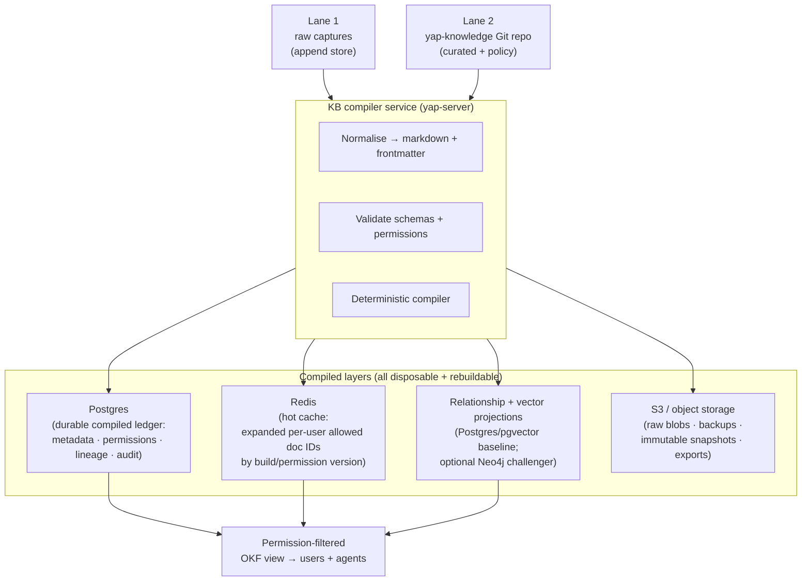

# ADR 0017: Team knowledge base — source-of-truth, compiled disposable indexes, and permission model

**Date:** 2026-07-01
**Status:** Accepted (roadmap — canonical Phase 9)
**Amended by:** [ADR 0022](0022-google-okf-permission-safe-projections.md) — adopts pinned Google OKF v0.1, defines the Yap Enterprise OKF profile and permission-safe virtual views, requires a Postgres/pgvector plus typed-edge baseline, and makes Neo4j a benchmark-gated graph challenger.
**Builds on:** [ADR 0014](0014-server-tier-compute-topology.md) (server tier), [ADR 0016](0016-auth-identity-bridge.md) (auth drives permissions), [ADR 0010](0010-okf-conversation-schema.md) (OKF file schema), [ADR 0011](0011-vector-rag-retrieval.md) (vector retrieval), [ADR 0012](0012-mcp-server-surface.md) (MCP surface)
**Identity-key rule:** Per [ADR 0016](0016-auth-identity-bridge.md), every user and group reference is tenant-scoped. Bare Entra object IDs are historical shorthand and are not valid cache, index, or authorization keys.
**Consolidates / supersedes server-profile details in:** [ADR 0009](0009-knowledge-worker-protocol.md) (knowledge worker IPC → server KB compiler API), [ADR 0010](0010-okf-conversation-schema.md) (adds two-lane store context), [ADR 0011](0011-vector-rag-retrieval.md) (SQLite → server-side vector DB for team profile), [ADR 0012](0012-mcp-server-surface.md) (MCP now runs in yap-server)

> **2026-08-10 execution amendment:** The smallest complete Phase 9 layer uses
> Postgres/pgvector as its sole compiled projection inside the staged monorepo.
> Redis, object storage, separate `yap-knowledge` hosting, webhooks, and their IaC
> remain optional Phase 10/IT operations work and are not Phase 9 dependencies.
> Neo4j activates only after a measured Postgres baseline gap. The diagrams below
> retain those long-term homes without claiming they currently execute.

## Context

The solo-profile knowledge base (ADR 0004, 0009–0012) stores everything as local OKF markdown and a SQLite index on the client machine. This is correct for one user; it breaks for a team:

| Problem | Manifestation |
|---------|---------------|
| **No shared knowledge** | Each user has their own private markdown; meeting notes are not visible to other participants |
| **No permission model** | Local files have no per-user access control |
| **No history/blame** | Markdown files can be overwritten without any diff or rollback |
| **High-volume writes from raw captures** | Meeting transcripts are high-frequency machine writes; Git commits per transcript cause commit storms |
| **Search across all users** | The local SQLite index is per-user; team search is impossible |

The knowledge base for the team profile is primarily **text**: meeting transcripts, Wispr-style notes, agent summaries, decisions, markdown documents. This shapes the right storage primitives.

### Mental model

> **Git = knowledge base / "source code of knowledge."
> Markdown = storage format.
> Frontmatter = metadata.
> Permission files = mutable access source-of-truth.
> Postgres = compiled ledger.
> Redis = optional later speed layer, never authority.
> Relationship/vector projections = disposable indexes; Postgres/pgvector is the baseline and Neo4j is a gated challenger.
> S3/object storage = optional production raw/blob/backup handoff.
> Agent artifacts = generated knowledge with provenance + inherited permissions.**

This is **not** OneDrive-style file sync. It **compiles** authorised, versioned knowledge views from source, similar to how a build system compiles source code into an executable.

## Decision

### Two-lane store

The central design insight is that raw machine writes and curated human writes have fundamentally different versioning needs:

| Lane | Content | Write pattern | Version primitive |
|------|---------|---------------|-------------------|
| **Lane 1 — raw capture** | Meeting transcripts, live notes, conversation imports | High-volume, append-heavy, machine-generated | Content-addressed immutable versions (content hash + monotonic IDs / append-only rows) |
| **Lane 2 — curated / policy** | OKF markdown docs, agent summaries, permission files, schemas, relationship edges, decision records | Low-volume, human/agent-paced | Git commits in `yap-knowledge` repo |

**Lane 1 does not use Git commits.** Committing every meeting transcript would create commit storms and make `main` a write bottleneck. Content-addressed versioning (hash + ID) is the correct primitive for write-once, append-heavy data.

**Lane 2 does use Git.** PRs, review, blame, rollback, and citation to an exact `commit:line-span` are genuinely valuable for curated knowledge and policy files.

**Migration path:** Lane 1 can start as a Git-compatible store (append-only subdirectory, not committed) and migrate to a dedicated content-addressed store when transcript write volume crosses a monitoring threshold. Because all indexes are disposable and rebuilt from source, this migration is cheap.

### Source-of-truth: `yap-knowledge` Git repo

The `yap-knowledge` repository (ADR 0018) is the **source-of-truth for curated content (Lane 2)**:

```
yap-knowledge/
  meetings/               # Lane 1 entry point (normalised OKF, before curated)
  conversations/          # curated conversation bundles (Lane 2)
  jargon_glossary/        # term cards (Lane 2)
  work_artifacts/         # todos, exports, agent summaries (Lane 2)
  team_knowledge/         # shared team docs (Lane 2)
  permissions/            # mutable permission source-of-truth (Lane 2)
    _team.yml             # org-wide defaults
    <path-prefix>.yml     # path-scoped overrides
  schemas/                # document schemas (Lane 2)
  agent_artifacts/        # immutable provenance-tracked artifacts (Lane 2)
```

**Access rule:** only the KB compiler service in `yap-server` reads the `yap-knowledge` repo in full. End users never clone it directly. A raw Git repo has no per-file access control; the compiled, permission-filtered OKF view is what users and agents receive.

### Compiled, disposable layers

All indexes are **rebuildable from source**. Editing permissions or schema never requires a data migration — just a recompile.



#### Postgres — durable compiled ledger

| Content | Notes |
|---------|-------|
| Document metadata (title, path, source, version/commit, content hash) | Used to build the allowed-path list |
| Compiled permission sets (JSONB) | Denormalised per-user, per-path for fast lookup |
| Lineage records (agent artifact → source files + versions) | Provenance for audit |
| Audit log (identity + permission events, compile runs) | Required for regulated environments |
| Build run metadata (compile version, source commit, timestamp) | Reproducibility |

JSONB is used for compiled policies and provenance blobs; these are **compiler output**, not schema-locked relational data.

#### Redis — hot cache

| Content | Notes |
|---------|-------|
| Expanded per-user allowed doc IDs / paths | Pre-computed at compile time; keyed by `(tenant_id, subject_id, build_version)` |
| Allowed knowledge-tree by build version | Invalidated on permission recompile; never the source-of-truth |
| Session tokens (short TTL) | Auth adjacency |

Redis is **never** the permission source-of-truth. It is a speed layer over Postgres. A Redis miss falls back to Postgres, never to the raw permission file.

#### Relationship and vector projections

ADR 0022 requires Postgres typed relationship tables plus pgvector as the Phase 9 baseline. Neo4j is an optional graph/vector challenger and is implemented only after representative fixtures demonstrate a material multi-hop benefit that justifies another service. The chunk fields below apply to any vector adapter; typed relationship records additionally carry source provenance, authority, permission hash, and build generation.

| Schema field | Notes |
|--------------|-------|
| `chunk_id` | Unique ID for this retrieval chunk |
| `doc_id` | Document identifier in Postgres |
| `source_path` | Path in `yap-knowledge` repo |
| `repo_commit` / `content_hash` | Links chunk to exact source version |
| `permission_hash` | Hash of compiled permissions at index time; stale chunks are skipped on lookup |
| `access_tags` | Pre-compiled tenant-scoped principal references such as `(tenant_id, subject_id)` or `(tenant_id, group_id)` (denormalised for fast filter) |
| `heading` | Section heading for citation |
| `char_span` | `[start, end]` character offsets in source document |
| `embedding` | 384-D or 768-D semantic vector |

The vector projection is **disposable** — it is rebuilt from OKF sources at any time. It is **not** the permission source-of-truth: every search result must still pass through the compiled Postgres permission view before being returned to the user. A later cache must preserve that check. The `permission_hash` field enables efficient stale-generation rejection and any future cache invalidation.

#### S3 / object storage

| Content | Notes |
|---------|-------|
| Original audio/video files (if retained) | Optional; org-policy decision |
| Backups of `yap-knowledge` repo + Postgres | Disaster recovery |
| Compiled immutable snapshots/bundles | Point-in-time exports |
| Lane 1 raw transcript blobs | Append-only, content-addressed |

S3 is **not** the knowledge system's heart. It is a raw/backup tier.

### Permission model — invariants

These invariants are **non-negotiable** for correctness and security:

| Invariant | Rule |
|-----------|------|
| **Permission source-of-truth** | The permission/metadata file in `yap-knowledge` is the sole mutable source-of-truth. Every index is disposable. |
| **Compile trigger** | A reviewed source revision enters the deterministic compiler, which stages and validates a complete Postgres/pgvector generation before atomic activation. A future repository webhook may trigger the same compiler but is not the authority. |
| **No inline permission checks** | Viewing a knowledge tree never opens a markdown file to decide access. It checks the compiled Postgres permission view, then returns only the allowed current-generation OKF projection. |
| **Optional-cache fallback** | If a later cache is introduced, a miss falls back to Postgres, never to raw policy input. Phase 9 ships no cache. |
| **Agent artifact inheritance** | An artifact (summary, entity card, decision record, relationship graph) inherits the **strictest effective permissions** of all its sources: audience = INTERSECTION; denials = UNION; classification = MOST RESTRICTIVE. An artifact can never leak from its most-restricted source. |

#### Agent artifact permissions

Agent artifacts are **immutable paths** with provenance back to exact source files + versions:

```yaml
---
type: agent_artifact
artifact_id: "2026-07-01-action-items-meeting-abc"
generated_by: coordinator
sources:
  - path: meetings/2026-07-01-abc.md
    commit: a3b2c1d
    char_span: [0, 4200]
  - path: team_knowledge/project-x.md
    commit: f1e2d3c
    char_span: [100, 800]
effective_audience:  # intersection of source audiences
  - alice@org.com
  - bob@org.com
effective_classification: confidential  # most restrictive of sources
denials: []  # union of source denials
schema: 1
---
```

### Compile flow

```
Capture / edit
  ↓
Normalise to markdown + YAML frontmatter
  ↓
Lane 1: append to content-addressed store (raw captures)
Lane 2: commit to yap-knowledge Git repo (curated/policy)
  ↓
Webhook / event fires on Lane 1 threshold or Lane 2 commit
  ↓
KB compiler:
  1. Validate schemas (reject malformed docs)
  2. Validate permissions (reject policy conflicts)
  3. Deterministic compile:
     a. Postgres — upsert metadata, compiled permissions, lineage, audit
     b. Redis — refresh expanded per-user allowed paths (keyed by build version)
     c. Relationship/vector projections — update Postgres edges and pgvector embeddings plus any promoted adapter; invalidate stale records by permission hash and build generation
     d. Allowed OKF tree — recreate permission-filtered view from current source
  ↓
Users + agents see updated knowledge
```

**Important:** the compile is **deterministic** — given the same source version and permission files, it always produces the same Postgres rows, Redis keys, and vector embeddings. This enables incremental recompiles (only reprocess changed files) and full rebuilds (delete all indexes, replay from source).

### Solo profile (unchanged)

ADR 0009–0012's local OKF markdown + SQLite index is **retained as-is for the solo profile**. The two-lane store, permission compilation, and server-side indexes are team-profile-only.

## Consequences

### Positive

- **Version history + blame** — every curated document and permission change is traceable to a Git commit and author.
- **Permission correctness** — the compiled-permissions model means a permission change propagates atomically to all indexes on the next compile, rather than scattered across file ACLs.
- **Disposable indexes** — any index can be fully rebuilt from source at any time; no index state is canonical.
- **Agent artifact isolation** — the inheritance model ensures agents cannot accidentally leak restricted source content into broadly-visible artifacts.
- **Citation precision** — every RAG result and agent artifact can cite an exact `commit:char_span` in `yap-knowledge`.

### Negative

- **Compile latency** — a permission change is not instantaneous; it stages and
  validates a complete generation before atomic activation. Phase 9 uses
  deterministic full generations; incremental compilation or caching requires
  later measured evidence.
- **Operational complexity** — the Phase 9 candidate owns only the compiler and
  Postgres/pgvector projection. A separate Git host, Redis, object storage, and
  production IaC would add services and remain Phase 10/IT handoffs.
- **Two ingestion lanes** — Lane 1 and Lane 2 have different write paths; the KB compiler must handle both without confusion.

### Neutral

- ADR 0010's example frontmatter is historical. ADR 0022's pinned Google OKF base and Yap Enterprise OKF profile govern canonical Phase 9 concepts and compiler behavior.
- The vector DB schema adds `permission_hash`, `access_tags`, `repo_commit`/`content_hash` fields to the ADR 0011 chunk schema; the retrieval flow and confidence gate are preserved.

## Executing Phase 9 ingestion paths

### Lane 1 ingestion path

```
Client captures meeting audio → Pass 2 produces OKF conversation
  → reviewed meeting result is bound to tenant/subject/source identity
  → deterministic OKF compiler validates and normalises the bounded source
  → append immutable reviewed-capture identity
  → stage complete Postgres concepts, relationships, permissions, chunks,
    and model/revision-bound embedding inputs
  → validate and atomically activate the generation
  → (No Git commit for Lane 1 raw captures)
```

### Lane 2 ingestion path

```
Reviewed curated source tree
  → deterministic OKF compiler validates paths, schema, provenance, and policy
  → stage complete Postgres/pgvector generation
  → validate and atomically activate the permission-safe OKF view
```

A future separate `yap-knowledge` repository and webhook may invoke the same
compiler after Phase 10/IT hosting decisions. They are not executing Phase 9
dependencies.

### Permission file format (normative)

```yaml
# yap-knowledge/permissions/<path-prefix>.yml
path_prefix: meetings/2026-Q3/
audience:
  users:
    - alice@org.com
    - bob@org.com
  groups:
    - engineering
classification: internal
denials:
  users:
    - contractor-x@org.com
```

The compiler resolves permission-file names inside the configured tenant and expands group membership from Entra ID (ADR 0016) to tenant-scoped `(tenant_id, subject_id)` principal keys at compile time. Group IDs are tenant-scoped as well. Unresolved or cross-tenant principals fail closed.

### Canonical Phase 9 deliverables

- [x] Deterministic bounded OKF source/compiler modules in `yap-server`.
- [x] Immutable reviewed-capture and reviewed-meeting Lane 1 ledgers with exact
  content, source, owner, and revision identities.
- [x] Deterministic curated-source compilation without requiring a webhook or
  separate repository during the staged-monorepo phase.
- [x] Postgres schemas for generations, metadata, permissions, lineage, audit,
  chunks, typed relationships, terminology, proposals, captures, and pgvector.
- [x] Atomic stage/validate/activate, rollback/history, retention, orphan
  cleanup, deterministic rebuild, reconnect recovery, and stale-generation
  rejection.
- [x] Permission inheritance for generated proposals and governed cited
  retrieval/MCP interfaces.
- [x] Retain Postgres/pgvector as the sole Phase 9 projection. Do not add Redis
  or Neo4j without measured need and a separate gate.
- [ ] Production `yap-knowledge` repository extraction, webhook/trigger
  integration, object storage, backup/restore policy, monitoring, encryption,
  and IaC remain Phase 10/IT handoffs.
- [x] Exact candidate `a4f34678ea9980379b18266d40d3347b818ac57e`
  passed the one complete Phase 9 gate: it restarted the real owned Postgres
  process, recovered cited retrieval, rejected the stale generation after
  successor activation, retrieved the successor, and proved exact teardown.
  Exact hosted-green head `fa26caaf7e3ea4e20f27b390355dff80bee2464f`
  merged through PR #152 as `ae81ff067c73a64528eecc14403765562726f2fe`.
  Production database operations remain Phase 10/IT handoffs.

## Open questions

1. **Lane 1 migration threshold** — What specific metric (e.g. transcript commits/day, repo size, CI time) triggers migration from the Git-compatible Lane 1 design to a dedicated content-addressed store? Monitoring-driven; not a fixed number.
2. **Graph challenger promotion** — Postgres/pgvector is the required baseline under ADR 0022. Benchmark Neo4j's multi-hop accuracy, filtered recall, hybrid rank quality, latency, resources, rebuild behavior, licensing, and operations before deciding whether it should replace the relational relationship projection, the vector adapter, both, or neither.
3. **Permission compile latency SLA** — How quickly must a permission change propagate to all users? (Seconds? Minutes?) This drives the compile pipeline design (incremental vs full rebuild).
4. **`yap-knowledge` repo host** — Self-hosted Gitea on the org LAN vs GitHub Enterprise? Must be reachable from `yap-server`; must satisfy the org's data-residency requirements.

## Alternatives considered

### Git for everything (Lane 1 and Lane 2)

**Rejected for Lane 1.** A Git commit per meeting transcript creates commit storms, makes `main` a write bottleneck under concurrent users, and bloat the repo history with machine-generated content. Git is excellent for Lane 2 curated content but wrong for Lane 1 raw volume.

### SQLite for the team profile (extend ADR 0011)

**Rejected for team.** A single SQLite file does not scale to multi-user concurrent reads/writes and cannot be deployed on a server without significant serialisation overhead. SQLite remains correct for the solo profile.

### OneDrive / SharePoint / cloud file sync

**Rejected.** File sync provides no compiled permission model, no deterministic rebuilds, no version-to-line-span citations, and sends data to a third-party cloud. The Git + compiler model is architecturally superior for knowledge management.

### Single-permission check at read time (open files, check ACL)

**Rejected.** Opening every markdown file to check an in-file ACL on every
knowledge-tree view is slow, inconsistent (what if the file is corrupted?), and
leaves no audit trail. The executing compiled Postgres permission view is
auditable and deterministic; a future cache may accelerate it but cannot replace
its authority.
