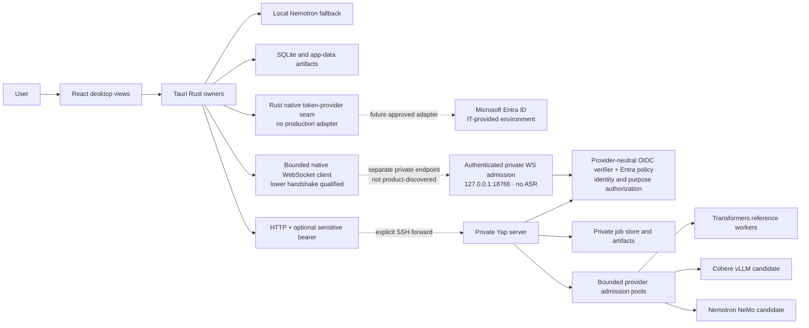

# Current Architecture

This document describes the merged executable Phase 1–6 system plus the active
Phase 7 executable boundary. Phase 7 focused evidence now covers provider-neutral
OIDC verification with Entra policy, fail-closed authentication, tenant-scoped
ownership, enforced purpose authorization, authenticated bounded private
WebSocket admission, and the native lower handshake. The desktop exposes a
narrow native token-provider seam but has no approved production adapter; the
live boundary has no ASR route, endpoint discovery, or external secure edge.
The replacement delivery gate now freezes command deadlines, keeps its
one-attempt capability private, verifies exact Windows DACLs, pins system
SSH/PowerShell hosts, and binds authenticated remote helpers through cleanup
and teardown. The current lifecycle resolves GB10's stock `socat` package link
to its absolute regular executable before container mutation. Exact head
`c5d826ffb85a841e412e41155a3c6c82a2fbe3e4` made equivalent canonical
language-routing saves true runtime no-ops, then was consumed when its first
admitted controller over-constrained the safe fixed receipt ancestor. Exact
head `dece4265e052d775d2d11f1883cd8cc4b2b25191` retained the lifecycle and
language-routing repairs, corrected the receipt ancestry, passed all three
exact-tree review lenses, complete private prequalification, and admission,
then was consumed before the locked `uv sync` command or owner flow because
portable PowerShell could not resolve the reviewed absolute `uv` executable
under the non-interactive SSH `PATH`. Its mode-`0700` per-head directory
existed, but its receipt remained absent and no runtime owner started. Exact
head `63600096cd8afe9f4435f6302c584f89dbdb5915` preserved that boundary,
authenticated the complete absolute `uv` chain and executable, passed all
three review lenses, complete prequalification, admission, and all 13 private
receipt children, then was consumed when its one complete matrix rejected a
reparse-tagged installed JavaScript notice. The repository lock, inventory,
and MIT notice were exact; the private checkout's default pnpm hardlink shared
the reparse-tagged content-store inode. Exact head
`d4adc832da90ef5a65ca8e6a9d702d833e55dbe8` corrected that materialization,
passed all 13 private children, and reached native tests in its one complete
matrix. Every Rust test passed, but the supported MSVC toolchain retained its
`vctip.exe` helper inside the owned Windows Job and correctly consumed the
head. The approved `OptIn=0` change did not prevent signed `VCTIP.EXE` from
being launched by `link.exe`, consistent with Microsoft's required-diagnostics
exception. The successor keeps strict Job containment for Yap runtime and
ordinary candidate commands, resolves the optional-diagnostics reader through
the kernel object-manager SystemRoot, and executes native compile/link evidence
outside the product Job on the exact reviewed head in fresh GitHub-hosted
Windows VMs before merge. Connector and required WDIO runtime trees on those
VMs remain Job-contained and must prove zero active processes; the running WDIO
binary also reports the reviewed build SHA. Exact head
`944673071804d8178776efa1d1e13651c87df6fb` passed all three review lenses,
prequalification, admission, all four private controllers, independent
validation of all 13 private receipt children, and its complete 25-cell matrix.
PR #69 opened on that head. GitHub rejected the first CI dispatch while parsing
the workflow, before any job or runner started, because job-level `env`
referenced `runner.environment` before runner assignment. That exact head is
therefore consumed as merge authority without relabeling its private results.
Workflow successor `cafbe307...` step-scopes the runner binding and adds the
regression contract; it is preserved after fresh target-client qualification
exposed bounded pending-ASR saturation during cold warmup. Exact repair
`32cf528...` adds bounded FIFO batch catch-up, passed focused same-three review,
and passed repeated-resource, nine-case prepared-audio, and physical-
microphone/rendered-UI qualification with zero audio drops. Its first isolated
scheduler-outlier attempt remains failed evidence. Documentation reconciliation
is committed at `e019036...`. Exact successor `dc635916...` passed its complete
private 25-cell matrix and independent receipt validation. CodeQL passed, while
hosted CI run `30574652702` exposed only checkout-test dependency timing,
GitHub Windows temp-owner mismatch, and equivalent 8.3/long-path spelling
assumptions. Stock NSIS was not dispatched after that failure. Reviewed repair
`558fed0...` makes those boundaries portable without changing product runtime,
identity policy, or the enterprise ownership boundary. Pre-admission
preparation of exact descendant `c95cfe0...` then exposed that writing an
already-correct owner can require elevation under ordinary development-root
ACLs. That head was never admitted. Repair `a823b28...` writes the owner only
when the observed SID differs, while the exact post-write owner/DACL check
remains fail-closed. Fresh exact-tree prequalification/admission, the complete
replacement matrix, hosted closure, and merge remain open.

The merged Phase 6 boundary includes the provider catalog, fixed-language
decision, local primary-language conditioning, durable preprocessing, advisory
VAD, local language spans, verify-only AmberNet batch preflight, and
provider-specific serving candidates. Exact executable candidate
`a92f338546a2f8bbaded96b04f8987f0ac475c88` passed its frozen one-attempt
30-child local/native/server/private-runtime matrix after bounded three-agent
remediation re-review. Runtime images were prepared before admission from
locally present digest-pinned bases and pinned dependencies. The admitted gates
validated a frozen private preparation-receipt hash, inspected the exact
prepared ARM64 image, and required its checked-head
revision, base digest, runtime identity, and immutable image ID to match that
receipt. They launch and record that exact ID; they cannot build, pull,
reconnect, or substitute an image. Hosted CI, CodeQL, and stock-NSIS passed at
first attempt on final reviewed head
`50f0f9e5e3cf288f41efa3745514dd08c9ee1929`, and its private closure receipt
was independently validated outside Git. PR #67 merged as
`87c8654250cba8b9eafa5007bf719c52e4749cdf`. The
[Voice OS architecture](../VOICE-OS-ARCHITECTURE.md) remains the first-class
long-term frame; accepted future work is sequenced by the
[roadmap](../roadmap/ROADMAP.md) and ADRs, not promoted into current-state
claims before it executes.

## System context



The SSH forward is a development access boundary managed outside Yap. It is
not an application TLS endpoint or enterprise deployment.

## Desktop

### React projection layer

`desktop/src/` renders the installed desktop experience. `App.tsx` composes
feature hooks and views; it does not own native job, recording, connector,
path, or result transitions. Feature hooks hold navigation, selected-item,
preview, draft, and loading state. Native snapshots/events are re-read after
missed or stale events instead of being promoted into a second durable owner.

The live surface is one renderer hosted in the native `live-overlay` window.
View variants, waveform, reduced-motion behavior, and presentation timing live
under `components/live/`; native code owns window identity, bounds, placement,
visible region, and lifecycle. The renderer reads the OS reduced-motion
preference synchronously for its initial state before subscribing to changes.
Pointer hover may expand the idle island, while keyboard focus inside the
toolbar suppresses pointer-exit collapse. Focus loss schedules the bounded idle
collapse; pointer exit does the same only when focus is already outside the
toolbar. Native bounds stay synchronized to the resulting surface.

### Tauri/native boundary

`desktop/src-tauri/src/app.rs` composes startup/shutdown, the tray, windows, and
owned background tasks. `commands/*` and `jobs/commands/*` authorize and adapt
WebView requests; domain owners below them perform transitions. Blocking
interactive workflows acquire their owner lease before opening a native picker
or awaiting server-origin confirmation.

Major native owners are:

| Area | Authority |
| --- | --- |
| Capture/frame/timeline/recording | `audio/*` |
| Live state, actions, shortcut runtime, and local stream resources | `live/*` |
| Imported job state, scheduling, spool, retry, cancel, and result verification | `jobs/*` |
| Connector configuration, health, generations, retry, and batch contract | `server_connector/*` |
| Source/path admission and playback leases | `media_protocol/*` and `recording_access/*` |
| Transcript/catalog/file actions | `live/recordings/*`, `commands/history/*`, and `file_actions/*` |
| Local model download/integrity/Nemotron lifecycle | `stt/*` |
| Canonical and legacy app-data paths | `paths/*` |

Desktop durable truth is native SQLite plus hash-bound, atomically published
files under Tauri's canonical app-data directory. On Windows this is
`%APPDATA%\com.mcnatg1.yap`. Recognized legacy entries from
`%LOCALAPPDATA%\Yap` migrate through a serialized, non-following,
conflict-aware, hash-verified process. An unsafe conflict stops startup and
leaves source data recoverable. Persisted file consumers use bounded,
no-follow regular-file reads with opened-handle identity/extent checks; the
install namespace and connector configuration fail closed on unsafe state.

### Local live fallback

The user explicitly installs the pinned local model bundle. Native code
re-verifies artifacts at load, preflights the input device, creates bounded
capture/worker paths, records exact loss evidence, streams to one in-process
Nemotron recognizer, and atomically finalizes recoverable audio/transcript
artifacts. A failed worker cannot manufacture a complete capture.

Shortcut enrollment is a deliberate native interaction. One runtime owner
normalizes physical input, dispatches through 16-event and 4-action queues on
two fixed process-lifetime workers, and records registration/startup failures.
Window and UI callers request transitions; they do not implement a second
shortcut state machine or create per-event threads.

### Imported Phase 5 job

```text
native source admission
  -> bounded canonical-WAV validation/extraction
  -> immutable Yap spool + manifest/chunks
  -> SQLite transition
  -> create/upload/commit/status/result through bound origin
  -> native result verification and atomic publication
  -> native history catalog
  -> React projection
```

The external source is immutable from Yap's perspective and is never deleted
by cancel, retry, or retention. Cancellation is a durable outbox action. A
retry creates a new server binding while preserving the source. Configuration
generation and origin bind all in-flight work so stale responses cannot become
current truth. OS drops enter one fixed worker with a one-batch backlog and a
200-path admission bound; one lease spans each blocking native picker.

## Private server

`server/src/yap_server/api/*` owns bounded HTTP parsing and response projection.
`jobs/service.py` coordinates the job transaction through separate contract,
store, upload, completion, artifact, and runtime owners. The service supports
idempotent create, exact chunk replay, manifest-bound commit, status, immutable
result, cancellation, restart recovery, bounded retention, and safe private
artifact cleanup. Uploaded chunks are reopened as bounded regular files and
must still match their declared exact extent and SHA before exclusive atomic
WAV publication.

`server/src/yap_server/live/*` separately owns authenticated WebSocket admission
at numeric loopback port `18766` by default. It requires exact `yap.live.v1`
negotiation, reuses the HTTP token/principal-access boundary, limits connections,
messages, queues, and replay, and rechecks expiry and revocation. It is a
transport and admission primitive only: no live ASR or transcript publication
route consumes it, and the desktop product does not discover this separate
internal endpoint.

`pools/*` owns bounded admission and isolated GPU workers. The reference
`BatchAsrPool` admits one running job plus two queued jobs. The current loopback
adapter dispatches each batch request directly to that pool; no durable
authenticated multi-tenant router queue executes yet.

The checked reference worker image uses the digest-pinned NVIDIA PyTorch 26.06
base, Python 3.12, the locked NVIDIA Torch/CUDA runtime, Transformers 5.13.1,
and immutable model/runtime contracts. Each transient reference container loads
one Cohere or Nemotron model in BF16, processes bounded work, emits one result,
and exits. Its generic `/torch-compile-cache` mount is only a bounded PyTorch
compiler cache. The worker runs non-root with no network, read-only/bounded
resources, and explicit fail-closed cleanup.

`server/src/yap_server/evaluation/*` is a separate non-production evidence
boundary, not a second serving owner. Its FLEURS source lock and comparator plan
bind the exact public release, Cohere model revision, `es-419` evaluation locale,
provider route `es`, batch shape, scorer, and transcript-free aggregate. Corpus
bytes, references, hypotheses, and run receipts live only under an explicitly
private external `YAP_EVAL_CACHE`; repository and hosted-CI fallbacks do not
exist. The evaluator streams validated WAV members without extracting them,
publishes case and aggregate JSON atomically with private permissions, and uses
the same locked Python 3.12/NVIDIA Torch/CUDA/BF16 model contract as the
reference worker. Its successful 908-case GB10 run is descriptive regression
evidence and does not own runtime routing, model promotion, capacity, or product
result publication.

Independent-promotion loading additionally uses a private, out-of-band-digest-
pinned registry. It binds the complete frozen candidate/exposure set and one
case-level human-reference receipt, authorizes the required listener,
adjudicator, locale, and rights roles, and verifies separate blind-assignment,
review, adjudication, locale, rights, attribution, and preprocessing artifacts.
The source-identity receipt separately binds the corpus item and source URI,
snapshot, original recording/retrieval times, upstream URIs, and
original/reference/legal hashes. The receipt also fixes suite/condition labels,
speaker/timing metadata, and canonical audio shape. Bounded same-open reads
verify the opened handle remains inside the private cache; portable paths reject
Windows alternate streams, while duplicate JSON keys, replacement, excessive
aggregate I/O, and oversize fail closed. The receipt must match exact rights,
defects, locale, and timestamp. No real reviewed production registry exists
yet, so this executing trust boundary is not provider-promotion evidence. Phase
6 retains the resident services as replaceable candidates and uses the
advertised-route contract smoke plus runtime-safety gate only as integrated MVP
evidence; any later route promotion must supply the complete reviewed registry.

ADR 0025 replaces the attempted universal ASR plane with provider-specific
runtimes behind Yap's existing worker-neutral contracts. Cohere batch now has a
digest-pinned NVIDIA vLLM 26.06 candidate: vLLM owns model residency and
continuous GPU scheduling while Yap retains bounded admission, durable jobs,
cancellation, validation, and publication. Nemotron keeps the pinned
Transformers/BF16 correctness route and uses a NeMo toolkit cache-aware service
as its separate server streaming promotion candidate. Local Nemotron remains
sherpa-onnx. The Cohere
vLLM adapter and a resident Nemotron NeMo adapter each now have bounded
loopback/API-key transport, exact readiness identity, provider-neutral worker
integration, checked image contracts, and launchers under focused tests. The
current three-lens-reviewed Phase 7 lifecycle successor starts both
launchers, their sampler, and the numeric-loopback proxy behind an explicit
release barrier, retains a pidfd before release, and reaps the exact child.
Before container mutation, the proxy canonicalizes the PATH-selected `socat`
command and retains only its absolute regular executable target; this accepts
the qualified GB10 package symlink without executing through a replaceable
link. Provider launch separates Docker create and start, records the exclusive
container ID, and publishes private recovery identity before creation. A
signal-interrupted create is clean only after the token-owned immutable ID is
captured and directly proven absent; otherwise the identity remains and the gate
fails closed. Name or label replacement never substitutes for immutable-ID
absence. The launcher propagates failure to retire any private recovery
artifact, while normal gate teardown independently requires the recovery
record, partial publication, and container-ID file all absent before it clears
the proxy path. Docker auto-removal is disabled so a naturally exited provider
remains addressable for bounded log capture before explicit immutable-ID
removal.
Recorded token-owned process-group identity remains the abnormal-exit recovery
boundary; this focused repair is not complete-gate or provider-promotion
evidence. The
NeMo candidate retains one cache-aware scheduler owner and bounded independent
job cancellation. Its transport uses a bounded reusable HTTP worker pool, while
the distinct model admission boundary remains eight active requests so control-
plane cancellation can still be serviced. It is not client-facing live
transport. Focused GB10 service
probes preserved Cohere's Transformers reference hash across c2/c4/c8 and
exercised vLLM's disconnect-to-engine-abort boundary, while NeMo formed one
batch of eight isolated fixed/auto requests; both recovered and tore down. A
later source-backed metrics control confirmed that the pinned external abort is
not added to vLLM's finished-request histogram. Exact executable candidate
`a92f338546a2f8bbaded96b04f8987f0ac475c88` subsequently passed the composed
18-child duration, identity, language-contract, cancellation, admission,
resource, and teardown candidate-safety lifecycle as part of the complete Phase
6 matrix. Its public-safe aggregate has SHA-256
`98cdc087b574f35a0e12b386a5d8c4c576a9ada548afe88101d1442868e96deb`.
Representative parity/
locale/quality, frozen percentiles, and rollback remain open for any later
provider-selection comparison. Neither candidate has been promoted. The earlier
Triton Python-backend experiment remains historical negative evidence because parity-
preserving execution serialized model calls without a demonstrated throughput
gain. SGLang remains a later agent/LLM choice, and persistent supervised
production deployment remains Phase 10 work.

Source-exact focused GB10 smokes at executable commit
`fcccf21e785b116b92cd8e46150a36b9b5ee91db` additionally ran each full locked
model through its real Yap adapter and left no owned container or listener. They
close basic image/model/adapter integration only; the frozen comparisons and
promotion gates above remain open.

Exact executable head `05d1b82017447df04d46ccc8fa729c5a6a0d0b13` passed the
focused assembled Windows-desktop/private-server slice. A real desktop import
produced a durable capture/preprocessing manifest; the immutable job survived
one SSH-tunnel interruption and recovery; the advertised fixed `en-US` Cohere
route published a verified server-authoritative result; the desktop opened that
same result from History; and teardown retained no owned remote resource. This
is end-to-end contract and lifecycle evidence for the integrated MVP, not
provider promotion, broad quality evidence, or completion of the Phase 6 gate.

Provider admission has two explicit owners. Cohere's resident vLLM process
uses `--max-num-seqs 8` for active scheduling and may queue internally; it is
not treated as a reliable HTTP 429 source. Yap's batch pool therefore owns the
executable 8-running + 8-queued and aggregate-PCM rejection boundary. NeMo's
authenticated adapter independently owns eight active requests and a typed
ninth-request 429. The private qualification layer now has distinct standard,
cancellation, capacity, and fixed/automatic-language runners so completion
counts cannot stand in for the named semantics. Their composed frozen GB10
candidate-safety evidence passed at `a21964c19e56648e9fddcb5200de419e59a7687c`.

Checkpoint B removes two accidental dependency inversions without changing
those owners. Provider engines consume the neutral
`pools/pcm_audio.py` contract instead of importing the executable
`batch_asr_worker.py` adapter, with an AST dependency test guarding the seam.
The loopback server passes `BatchAsrPool` directly to `RecordingJobService`;
the removed wrapper only enqueued and immediately dispatched the same batch
request, so it never provided independent scheduling or fairness. The
non-executable reference router was also removed; ADR 0023 retains the accepted
future mixed-live/batch fairness rule, but Phase 10 must implement it against
real durable/authenticated owners. Neutral test support now owns shared
recording-job request builders. Desktop-wide bounded logging belongs to
crate-root `diagnostics.rs`, and crate-root `atomic_text.rs` owns durable text
publication; STT retains only ASR-specific adaptation and timing.

The production result contract permits canonical empty ASR text. Duration-
transport evidence therefore counts a published empty result as completed for
silent or too-short audio, while provider-behavior, request-lifecycle, and
resource-lifecycle cells still require non-empty output from their speech-
bearing fixtures.

Provider-behavior exact-track evidence separates recognized-word stability from
rendered formatting. Repeated immutable input is grouped by audio duration and
must retain one non-empty lexical identity; exact casing/punctuation identities
are reported separately and punctuation remains part of representative
reference scoring. Resource-lifecycle loads explicitly report but do not gate on
lexical variance; they gate request/result completion, provider idle state,
resource ceilings, and teardown instead.

Phase 6 standard short/long loads use a separate `request-lifecycle` scope.
They require every result to retain its job, input-audio, model, and output-path
identity, require non-empty output for the speech fixture, and require provider
idle read-back at the planned concurrency. They report lexical variance without
requiring deterministic wording from repeated audio. Provider-behavior remains
a later model-promotion boundary, including the Phase 8 Tiron comparison.

The NeMo fixed/automatic qualification follows the same separation. Both paths
must publish valid job/audio/model/language results; automatic output must also
carry detected locale segments and model/plan-bound source-time spans. Lexical
and rendered-text parity are observations, not Phase 6 contract conditions,
because automatic segmentation changes the decoding boundary.

Provider resource ownership is also explicit. The cgroup supplies current,
peak, task, and memory-event truth; the container entrypoint supplies RSS,
anonymous/file/shared composition, thread count, and virtual allocation extent;
NeMo responses additionally supply CUDA allocated/reserved and peak counters.
Runtime-plan schema 5 binds each candidate to a c8/1,600 GB10 profile with
current/peak and task/thread ceilings, zero memory-event increments, and a
64-MiB tail bound on virtual allocation-extent growth. Its observation window is
at least 125 seconds so the last-half tail cannot fall below the predeclared
60-second coverage merely because inference gets faster. Physical RSS regression
and range remain visible because unified-memory residency can oscillate, but
they are not substituted for allocation growth. Focused results selected these
thresholds, and both current-source profiles pass their eleven focused checks
plus clean teardown. The frozen checked-head candidate-safety run passed all
18 children at `a92f338546a2f8bbaded96b04f8987f0ac475c88`; the same exact candidate
also passed the separate client, AmberNet, advertised-route, accessibility, and
full-matrix children.

The server's dynamic health response advertises batch/status only when the
Phase 5 runtime actually initializes. Live streaming remains false and
`/v1/live` remains unimplemented.

## Merged Phase 6 implementation

Phase 6 added a separately bounded ASR capability-catalog endpoint,
native fingerprint/bounds validation, and an origin-bound last-known snapshot
that explains offline state without authorizing a route. Rust owns the
versioned primary-language preference and freezes each imported job's
primary/manual disposition through SQLite, preprocessing evidence, and the
server create contract. Local warmup serially reads that confirmed locale,
validates the exact 32-locale out-of-box Nemotron allowlist, and applies it to
every native stream and reset. Unsupported locales fail visibly; a preference
change invalidates idle warm state and cannot race an active capture. A picker/
drop batch retains bounded native-selection
proof before its non-runnable `accepted` rows can commit. Active playback is
projected before an unlocked row becomes `preflighting`; restart snapshot
recovery may consume the retained proof but never recreate it from a ledger path,
while a concurrent cancellation cannot restore authority. An already-locked
Phase 5 row retains the compatibility transition to `queued_server`. Background
preflight rechecks the selection registry, creates one immutable Yap-owned
normalization/VAD capture, and freezes a short configured decision or a confirmed
long-recording suggestion before promoting those exact bytes to remote upload.
Catalog validation, upload, result polling, retry, and failure paths retain one
exact job ID instead of rescanning a neighbor. React projects those native/server
owners.

Schema 9 adds desktop-authoritative bounded attempts for normalization, VAD,
LID preflight, and user confirmation; schema 10 binds the immutable client
preflight artifact and any in-flight LID request identity to the same job.
Imported canonical PCM WAV preprocessing
records identity normalization, then optionally runs the explicitly installed,
hash-verified Silero artifact through the existing `sherpa-onnx` CPU runtime.
It emits ordered source-sample/source-millisecond advisory intervals or a typed
bounded error and always retains the complete source. Server schema 6 records
ASR, alignment, and result-publication attempts with restart/retry admission and
bounded evidence; legacy rows remain readable without invented stage history.

Native selection is intentionally scoped to the canonical path, matching the
existing replace-in-place behavior. Each access reopens no-follow and takes a
fresh fingerprint; byte identity becomes immutable when preprocessing publishes
the verified Yap-owned spool. The path registry does not claim that an external
file can never change after selection.

The visible per-job recording-language selector derives from the catalog, which
still advertises only the locked, gated Cohere `en-US` fixed-batch route. It
does not manufacture a second option while later provider replacement remains
unproved.
The optional, explicitly imported AmberNet 1.12.0 QDQ INT8 plus Silero local
language path now loads once beside the single Nemotron ASR under `LiveRuntime`.
The exact native frontend, one-thread static-ORT session, immutable 107-label
map, three-observation/`0.40`-margin policy, and user-selected regional locale
catalog are bound into the component revision. The runtime partitions bounded
held audio exactly once at accepted switches, returns visibly to the primary
locale on ambiguity or failure, and stores revisioned source-time
span/decision evidence inside the hash-bound recording sidecar. Overlapping
detector windows and ASR commits use independent bounded cursors over the same
shared source frames, so detector history cannot cause ASR replay and ASR
commits cannot discard future detector input. The artifact is local-import only:
it is neither bundled nor network-downloaded while NGC redistribution review is
open. Focused runtime, exact-frontend, label-map, lifecycle, and private
holdout checks execute. A controlled release-mode i7-13850HX proxy restricted
the process to eight logical CPUs and routed 38.4 seconds exactly once through
resident Nemotron plus AmberNet/Silero. Four configured Nemotron threads were
oversubscribed: two threads improved the combined path to `0.431` RTF while
using 61.844 CPU-seconds, or about 1.61 logical-core equivalents when spread
over continuous real-time source arrival. A one-thread diagnostic remained
below real time at `0.484` RTF with lower CPU use but materially slower model
load. The executable default is therefore two threads. A follow-on source-paced
proxy delivered all 3,840 ten-millisecond frames
without loss through the production-sized 64-frame local-ASR queue, reached a
42-frame high-water mark, completed 864 ms after the 38.4-second source ended,
and averaged 1.765 logical cores (22.066% of the eight-CPU affinity budget).
Concurrent ten-millisecond scheduler probes observed 0.752 ms p95 and 6.966 ms
maximum wake delay. The language path added about 58.64 MB of private memory and
left about 7.92 MB after teardown. A harsher four-logical-CPU repeat still lost
no frames, reached 45/64 queued frames, drained in 911 ms, averaged 1.773 logical
cores during paced input, and measured 8.023 ms p95/45.864 ms maximum scheduler
wake delay. Its unpaced combined pass consumed 3.71 of four logical cores, which
is saturation evidence rather than an interactive workload claim. These are
accelerated and paced prepared-audio runtime proxies, not rendered-UI or
sustained release-lifecycle evidence. The route is available only as an
explicit, default-off Preview because its frozen natural-switch target failed;
exact executable candidate `a92f338546a2f8bbaded96b04f8987f0ac475c88`
later passed the focused current-host resource, restart/cancellation, no-server,
and unattended 30-second microphone/UI lifecycle work inside the complete
checked-head Phase 6 matrix.
Fail-closed checked-head native repeated-session and release-mode default-
microphone/rendered-UI collectors bind the observed Windows processor and
processor count and passed together at that exact head. Representative
longer physical-device, low-end battery, and thermal certification is deferred
to default-on or Phase 10 release qualification and cannot be inferred from
this Preview gate. A
deterministic duration runner can stream one explicit functional profile from
the prepared-audio-frame boundary through the production bounded adapter, the
same single live worker, and finalization. It locks the checked head, profile,
plan, private suite, manifests, raw WAV, and decoded PCM without retaining
transcript text or paths. Phase 6 consumes the nine 250-ms-through-30-second
`short-boundaries` cases. The default-microphone/rendered-UI channel supplies a
30-second unattended capture, responsiveness, save/delete, and teardown smoke
while requiring no configured or listening numeric-loopback server. It does not
duplicate speech/transcription evidence or assume that same-host Windows output
reaches the selected microphone. The separate 15-case
`complete-local-duration-ladders` profile remains available for default-on or
Phase 10 release qualification and does not replace current-host resource or
natural-accuracy evidence. A separately frozen clean German-English
representative set then retained
exact source coverage and the required primary-language fallback but detected
zero of four required natural alternate-language spans and matched neither the
entry nor exit boundaries. A post-failure diagnostic of the exact implemented INT8
detector found 68 speech-qualified windows inside those alternate regions but
only five alternate top labels and one observation above the `0.40` margin;
none appeared outside the alternate regions. The earlier FP32 diagnostic also
misclassified three of the four spans, while whole-clip FP32 and INT8 scores
were 322/340 and 323/340 respectively. The failed route is therefore recorded
as a short-window/domain limitation rather than an INT8 regression; it is not
retuned, and it blocks removing the Preview label or making a natural-switch
quality claim. The isolated server batch preflight now verifies one explicitly
imported AmberNet 1.12.0 INT8 QDQ artifact and exposes no bundle or download
path. Client and server independently select five exact six-second regions from
source start through exact tail; every region needs 3.2 seconds of advisory VAD
speech, two independent fixed three-second graph executions, a positive margin,
and the same normalized language as all other regions. Any missing, mixed,
unsupported, or ambiguous evidence stays manual, and a valid suggestion remains
inert until the user confirms it. The non-root/offline Python 3.12 NumPy/CPU-ORT
worker is limited to one thread, one CPU, 512 MiB, bounded PIDs/temp/output, and
one running plus two queued requests. Focused Windows real-model and disposable
ARM64 frontend/logit parity evidence exists. Exact executable commit
`c6862262fa36a83bcd40a7bffa65ec6429ec097e` also passed the real ARM64 worker
boundary at 111,591,424 peak cgroup bytes, six peak PIDs, 682,363 CPU
microseconds, and 0.842-second cold wall time with no throttling, OOM, or retained
container. Exact executable head
`a21964c19e56648e9fddcb5200de419e59a7687c` then passed the final source-exact
ARM64 repetition through the production worker command: 788 ms wall time,
670,672 CPU microseconds, 111,902,720 bytes current/peak cgroup memory, six peak
PIDs, zero memory events, and complete container/network/process/listener/request
cleanup. This is component lifecycle evidence, not representative suggestion
quality or phase completion. The old SpeechBrain two-probe GB10 receipt remains
historical evidence only. A server Nemotron
worker, explicit automatic-job language tags, fail-closed Cohere attention
alignment, the Cohere vLLM adapter, and the resident NeMo worker/service/image/
launcher now execute as locked focused slices. Separate focused GB10 service
proofs exercised independent Cohere c2/c4/c8 requests with vLLM engine abort and
one NeMo batch of eight; both cancelled without publication, recovered, and
removed their owned container/listener. A privacy-safe aggregate duration
control subsequently ran each candidate at 30-second c2 and c1 2-minute,
15-minute, two-hour, and exact four-hour inputs. Both published bounded results
and tore down; the four-hour controls used 4.272 GiB for vLLM and 2.356 GiB for
NeMo. Yap submitted each vLLM file as one offline API request; vLLM internally
scheduled long audio as multiple bounded engine chunks. NeMo advanced the
cache-aware streaming model in 1.12-second frames across finalized windows, but
this service returns only a final result, not partial text. The resulting
wall-time gap currently favors vLLM for offline long-form throughput and is not
client-facing streaming evidence. Engine-chunk histograms and API-request wall
latency remain explicitly different units. Repeated-fixture controls do not
prove sentinel integrity, natural long-form quality, frozen percentiles, or
promotion.

The Cohere image at exact executable commit
`da9f7682d6337df0d1bfb26e069781d8a64ec726` also includes a fail-closed
backport of the exact PyTorch upstream weak-reference-finalizer fix. A
source-exact ARM64 no-device reproducer and a real locked-model/public-fixture
lifecycle no longer emitted the prior finalizer traceback; the real lifecycle
also emitted no semaphore warning, observed engine/API shutdown, exited zero,
and released its container and loopback listener. This is focused implementation
evidence that predates the later passed provider candidate-safety lifecycle; it
is not the complete Phase 6 gate.

At exact executable commit `2caf1969000154ffba24511a5c35b57f7f975036`, a
natural AMI follow-up used the desktop production normalizer and Silero evidence,
reverified its chunk stream through server input preparation,
and built 37 contiguous utterance windows for each 17.49-minute close/far
recording. Cohere/vLLM completed in 8.615/4.473 seconds but measured
46.250%/42.367% normalized WER; NeMo/Nemotron completed in
18.065/16.858 seconds and measured 26.046%/37.919%. The promotion-ineligible,
known-defective public reference cannot select a default, but it establishes an
important architectural constraint: offline throughput, lexical quality, and
punctuation quality are separate provider capabilities. The catalog and router
must not encode a universal "accuracy model" label. Neither result exposed
speaker or timestamp output, so Phase 8 meeting inference and reconciliation
remain separate rather than being fabricated from the flat transcript.
The lower Open ASR AMI figure on Cohere's model card is not a contradictory
measurement: it comes from 12,643 duration-sorted individual-headset utterances
of at most 26.2 seconds under fixed-English row scoring, rather than either
complete 17.49-minute mixed/far-field condition. That public short-form protocol
is useful for regression diagnosis but cannot replace Yap's representative
long-meeting and overlap evidence.

These paths remain unadvertised/unselected:
the catalog still exposes only Cohere `en-US` with `wordAlignment: false`. The
model-neutral provider candidate-safety lifecycle and complete Phase 6 matrix
passed on exact executable candidate
`a92f338546a2f8bbaded96b04f8987f0ac475c88`, but representative
provider-promotion comparisons have not run. Both
candidate containers stay on an
egress-blocked internal bridge with no Docker-published port; their launchers
require separate private API keys. Their focused Phase 7 lifecycle successor
places launcher, sampler, and proxy targets behind one retained-pidfd
supervisor interface. Isolated/no-site system Python, exclusive regular-file
outputs, contained control-pipe writes, bounded pidfd failure, and exact
`waitid(P_PIDFD)` reaping protect initial ownership. Missing/failed results
fall back only after the direct supervisor is reaped and every surviving group
member verifies the run token. Proxy teardown reconciles the fixed container
name, immutable ID, and token before stopping it; no independently signalled
numeric-PID log follower remains. The active Phase 7 branch adds authenticated
tenant/user identity to
the existing REST/LID boundary and bounded private WebSocket admission on a
separate internal port. The native lower handshake is qualified, but no live ASR
route, endpoint discovery, external same-origin WSS/TLS edge, or persistent
supervised mixed-load production service exists. Phase 10 owns production
supervision, capacity promotion, observability, and enterprise deployment.

Local and server language evidence now share the narrow version-1 16 kHz
`LanguageSpan` wire contract without sharing a state owner. Local acoustic
decisions carry `clientDecision`; server automatic results carry
`serverUtterance`, complete canonical-source coverage, immutable model and
utterance-plan identities, and lossless text links through `sourceSpanIndex`.
Mixed or incomplete server text evidence makes the finalized utterance `und`.
The worker, durable server result, OpenAPI, and native admission validators all
reject missing, discontinuous, unbound, or provenance-mismatched evidence. This
does not promote server terminal tags to within-utterance diarization.

Dynamic server labels are correctable without weakening result authority.
History resolves the current native remote identity, revalidates the immutable
result, and lazily projects its bounded segments. A correction is a separate
append-only, strict-schema revision under the owned job root, hash-bound to the
exact `result.json`, its preceding correction, session, segment, source span,
and original label. One native mutex serializes writes and an expected revision
rejects stale UI actions. The server result, transcript, and retained audio are
never rewritten; restoring the server label appends another correction. History
shows effective correction and remaining-review counts only after the complete
chain verifies, and React renders the list in bounded pages rather than creating
one DOM row per possible segment.

## Authenticated identity and durable remote-account ownership

The server's common OIDC layer owns strict fixed-algorithm JWT validation and
bounded discovery/JWKS retrieval. Entra mode supplies the provider policy:
tenant issuer, audience, delegated scope, allowed native-client actor, required
claims, accepted roles, and canonical `(tid, oid)` identity. The default
`disabled` authentication mode fails closed for every non-health operation;
the fixed development principal is available only through an explicit
development-only loopback configuration. The exact health route remains public.

The identity repository owns principal upsert, a durable access-disabled latch
with explicit administrative restore, revisioned purpose grants, and redacted
append-only audit events. The `Yap.IdentityAdministrator` role gates purpose and
access mutations within one tenant. Enrollment requires `enrollment`; matching
requires `enrollment` plus `matching`; adaptation requires all three active
grants. Allowed and denied decisions are audited. This is an executable
authorization seam, not a voice-profile, embedding, or matching implementation.
The SQLite adapter is development evidence, not the selected production
database or audit sink.

The Windows client keeps local/offline dictation independent of authentication.
For server work, Rust owns a narrow in-process `NativeAccessTokenProvider`
interface, zeroizing token cache, account-plus-authentication binding, bearer
injection, and session invalidation. No production implementation is selected,
so interactive sign-in and silent acquisition fail closed as unavailable. No
token or raw provider account ID crosses into React or ordinary Yap persistence.
Account/configuration switching, sign-out, or attempts to attach ambiguous
earlier authenticated work fail before a different bearer can be sent. The
active account/configuration binding survives token-cache expiry, while each
protected dispatcher is fixed to one connector generation, approved origin,
and authenticated-session generation. Settings transitions
cancel and drain that session before settings or approval publication. Durable
cleanup remains queued without opening a socket when its persisted origin is no
longer the exact current approved origin or when its hashed account and
normalized tenant/client/API-scope configuration do not both match. Identity
lifecycle/status failure projects a fresh non-`Ready` connector snapshot after
invalidation. Public health describes server configuration, while `Ready`
additionally requires a bearer-authenticated protected-capability probe; 401,
403, and retryable admission failure remain distinct states.

Phase 7 carries the authenticated principal through HTTP middleware, job/LID
service admission, and the separate private WebSocket admission service. The
native WebSocket actor uses the same authorization source and session lease,
requires exact `yap.live.v1`, bounds messages and queues, and terminates on
session invalidation. Focused parity evidence qualifies the lower handshake
against separate HTTP and private-live ports. Product endpoint discovery,
external same-origin WSS/TLS, live ASR, owner-fair pool/router scheduling,
durable multi-tenant queuing, and sustained mixed-user capacity remain absent.

The pinned mock OIDC provider and owner-flow harness are focused-green. Hosted
Docker execution of that pinned provider remains pending. Exact head
`2f8b127fe20ec3cb1d62879532f20e3e220c4ca6` was withdrawn before GB10,
connected-server, or complete-matrix execution after pre-execution review
rejected its gate boundary. Retained-pidfd head
`9defb4a2202b5743f161dafb40f8fb2bc41b8fde` resolved the later three-agent
exact-tree findings but was itself rejected before admission when connected
prequalification exposed the GB10 `socat` package-link incompatibility. The
canonical-path lineage passes focused local and real-host proof. Later exact
head `c5d826f...` passed fresh private prequalification and admission but was
consumed by an over-strict private-ancestor mode assertion. Exact head
`dece426...` corrected that boundary, received GO from all three lenses, passed
fresh private prequalification and admission, then was consumed when its first
mock-OIDC controller could not resolve the reviewed `uv` executable under the
non-interactive SSH environment. No locked `uv sync` command or owner flow
started; the per-head directory existed and the receipt remained absent. The
next controller retains the safe receipt ancestry, authenticates every real
directory component and file in the absolute `uv` path, and proves that exact
path resolves inside portable PowerShell under the admitted command environment
before reservation. Exact head `63600096...` satisfied that boundary and passed
all four admitted private controllers plus independent validation of all 13
private receipt children. Its one complete matrix then correctly rejected a
reparse-tagged installed JavaScript notice produced by default pnpm hardlink
materialization. Exact head `d4adc832...` corrected that boundary and passed
fresh review, prequalification, admission, all four private controllers, and
independent validation of all 13 private receipt children. Its one complete
matrix passed every Rust test, then failed because the owned Windows Job
retained the Build Tools `vctip.exe` helper. The approved optional-diagnostics
opt-out was applied and verified, but a clean link still launched signed
`VCTIP.EXE` from `link.exe`. The next manifest verifies that local
optional-diagnostics setting with a fail-closed 64-bit registry-API read whose
helper path is rooted in the kernel object-manager SystemRoot. Native
formatting, Clippy, compilation, tests, dependency checks, and the WDIO build
move outside the product Job to exact-head clean GitHub-hosted Windows jobs
whose VMs are decommissioned after execution. Actual connector and required
WDIO runtime trees remain in kill-on-close Jobs, run without GitHub
credentials, and must prove assigned-before-resume plus active-process-zero.
The fresh runner is populated from the locked Python 3.12 environment before
the connector's offline recheck, and the running WDIO binary must report the
reviewed build SHA. Exact head `9446730...` passed review, prequalification,
admission, all four private controllers, independent 13-child validation, and
the complete 25-cell candidate matrix before PR #69 opened. Its first CI
dispatch was rejected during workflow parsing, before job creation, because
`runner.environment` was used at job-level `env`. The exact-head rule consumes
that merge candidate while preserving its private evidence. The narrow
step-scoped workflow successor `cafbe307...` passed focused review and is
preserved after its fresh target-client controller exposed bounded pending-ASR
saturation during cold warmup. Repair `32cf528...` keeps recording independent,
adds bounded FIFO batch catch-up, and passed focused same-three review plus
repeated-resource, nine-case prepared-audio, and physical-microphone/rendered-UI
qualification with zero audio drops. Its first isolated scheduler-outlier
attempt remains failed evidence. Documentation reconciliation is committed at
`e019036...`. Exact successor `dc635916...` passed the complete private
25-cell matrix and independent receipt validation; CodeQL passed, but hosted CI
run `30574652702` consumed it on the pre-install YAML import, Windows temp
owner, and equivalent 8.3/long-path assumptions. Reviewed repair `558fed0...`
passes focused contracts and all three review lenses. Exact pre-admission
descendant `c95cfe0...` was not consumed, but its private-input preparation
exposed an unnecessary same-owner write that could require elevation. Repair
`a823b28...` makes that write conditional on an exact owner-SID mismatch,
retains the final exact owner/DACL verification, passes focused Windows and
hosted-portability contracts, and has the same three review approvals. Fresh
exact-tree closure and prequalification/admission, the one complete replacement
gate, first valid hosted native/PR closure, and merge remain open. Real
IT-provided Entra and Conditional Access policy and an approved native adapter
remain external conformance work.

## Accepted meeting direction, not current execution

[ADR 0027](../adr/0027-tiron-joint-speaker-attributed-meeting-transcription.md)
selects pinned `Trelis/tiron` as the Phase 8 server development baseline for
joint speaker-attributed meeting transcription. No Tiron worker, ECAPA lock,
speaker-attributed scorer, or production result path executes today. The local
anonymous-speaker path and ASR-plus-diarization fallback remain separate.

Tiron's model capacity is eight window-local speaker slots per 30-second
decode, and the pinned reference harness separately caps the published global
meeting roster at eight. Neither limit is an attendee count. Yap retains ADR
0020's dynamic 32-speaker target and 64-speaker safety ceiling, but reaching it
requires the separately gated ADR 0027 speaker-epoch reconciler or the
ASR-plus-diarization fallback; ordinary chunking does not lift the released
global cap. Phase 8 must distinguish more-than-15-attendee sessions with a
small active subset from nine/sixteen/thirty-two-talker sessions, and must
explicitly degrade/reprocess a window that reaches or plausibly exceeds eight
distinct talkers.

The frozen Phase 8 gate will score AMI/ICSI/NOTSOFAR public comparators
separately from an independently adjudicated private messy-meeting holdout.
Accuracy, overlap, locale, capacity pressure, long-session stability,
c1/c2/c4/c8 isolation, cancellation, and teardown all remain promotion gates.
The model emits evidence only; Rust continues to own source validation, durable
jobs, admission, cancellation, immutable revisions, and publication.

## Persistence and recovery

| Durable boundary | Recovery invariant |
| --- | --- |
| Desktop SQLite job ledger | Transactional migration and replay preserve one job identity and accepted remote progress. Schema 8 adds a singleton metadata write probe; schema 9 adds bounded client-stage attempts without fabricating history for legacy rows; schema 10 binds the immutable preflight artifact and persisted LID dispatch identity; schema 11 renames the legacy language disposition; schemas 12–13 introduce versioned development or hashed native-provider account authority and quarantine ambiguous older authenticated bindings. After a mutation failure, an in-memory circuit blocks preprocessing and remote dispatch until the probe commits. |
| Recording commit/sidecar/transcript | Only hash-valid, atomically published lineage becomes complete History truth. |
| Remote result review | Native History derives fixed/dynamic/unknown-language and available/unavailable/legacy-timing summaries only from a verified immutable result, then projects them into the one existing transcript review surface. |
| Prepared spool/chunks | Only verified Yap-owned paths are cleaned; external sources are preserved. |
| Install identity | Bounded no-follow regular-file admission rejects linked, oversized, or invalid namespace state. |
| Connector configuration | Bounded no-follow regular-file admission precedes schema validation; one save lease spans confirmation, publication, approval, generation change, and applied-state projection. |
| Server job/chunk/result state | Schema 6 retains bounded ASR/alignment/result-publication attempts. Idempotency survives restart; interrupted processing and retry admission remain explicit without rewriting completed result authority. |
| Server identity repository | The provider-neutral repository owns principal, access-revocation, purpose-control, and redacted audit records. The SQLite adapter persists focused development/restart evidence; production topology, encryption, backup/deletion, retention/export, and administrative access remain external approvals. |
| Deletion intent/quarantine | Destructive work revalidates identity and resumes without following replacement paths. |

## Trust boundaries and limits

- WebView commands require the intended window/command authorization and typed
  validation.
- Imported files, native paths, server requests/responses, worker output, and
  persisted JSON/SQLite rows are untrusted at their admission boundary.
- Reads, files, chunks, responses, queues, retries, request workers, retention,
  model output, and process resources are bounded.
- Links, Windows reparse points, path replacement, physical file extent, and
  time-of-check/time-of-use races are handled by admission plus identity
  revalidation/leases where mutation requires it.
- Logs and public errors describe stable codes/state without private audio or
  transcript content.
- The HTTP application and private live-admission boundaries remain numeric
  loopback during development. Entra mode implements application authentication
  and owner authorization, but synthetic/mock tokens and a native provider
  interface without a production adapter do not imply real tenant policy,
  Conditional Access, MFA, certificates, DNS, firewall policy, ZPA, an external
  WSS/TLS edge, or enterprise deployment.

See the complete [ownership map](boundaries/EXECUTABLE-OWNERSHIP.md) and public
[security posture](../security/SECURITY-POSTURE.md).

## Build and verification boundaries

The frontend uses Node 24 and pnpm 11.7.0. Native code uses Rust 1.96. The
portable server supports Python 3.12 only. Windows automation requires
PowerShell Core 7.4 or newer. No desktop identity-provider SDK or sidecar is a
shipped runtime or build dependency. Installer lifecycle tests run only in a
disposable Windows environment.

Focused suites protect each extraction. Browser automation allocates an
OS-selected loopback port, and native restart automation terminates only its
exact isolated app process before bounded session cleanup. Phase 7 runs its
local/server/target-client/private-server candidate matrix once after an exact
head is ready. Every required CI closure job explicitly checks out that head
without persisted credentials and verifies the checkout before and after
project execution on its declared fresh hosted OS. Windows uses an absolute
no-space System32 bootstrap to stream the runner's extensionless temporary
script into the absolute PowerShell host; Linux starts that PowerShell host
directly. The initial proof captures PowerShell, one
deterministic Git application, the exact guard source, the Git index, and an
index-independent tracked-content manifest with their hashes. The final proof
reuses that absolute shell chain, verifies and executes the admitted guard bytes
in memory, rejects hidden index flags and linked tracked ancestors, forces Linux
executable-bit comparison, rehashes every tracked file, and reuses the admitted
Git identity; it does not resolve a mutable workspace helper or post-project
`PATH`. Native formatting, Clippy,
compilation, tests, dependency checks, and build run normally on that exact
reviewed head in required fresh GitHub-hosted Windows jobs. Connector and
required WDIO runtime trees run there
under the same kill-on-close Job supervisor used by candidate commands and
must finish with zero active processes. Hosted CodeQL and disposable installer
automation complete the closure before merge. The fresh VM is the lifecycle
boundary for Microsoft build-tool helpers; it is not the product runtime
cleanup mechanism.
