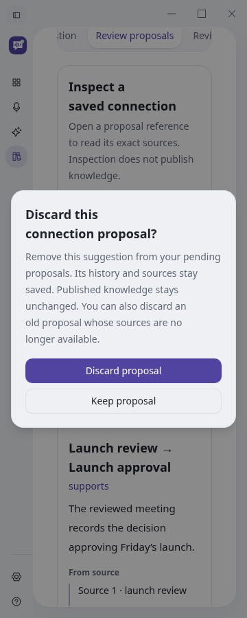
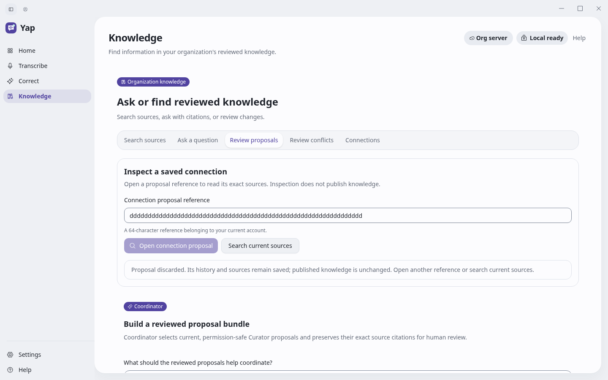

# Discard a saved connection

**Owner:** Grant McNatt. **Date:** 2026-10-03. **Status:** Local software checks pass;
hosted integration is pending.

Knowledge → Review proposals now offers **Discard proposal…** with explicit
confirmation. Keeping the proposal sends no write. Confirmation retires an owned
suggestion, including obsolete proposals, while preserving its history and sources.
Published knowledge stays unchanged. No model is required.

The authenticated DELETE accepts only a bounded proposal reference, with no body
or caller identity. Foreign, unknown and other-type references share 404. A tenant
journal lock protects ownership/type selection and discard. The tombstone and
content-free success audit commit together; failed auditing rolls back the change.
Discard frees pending capacity; retries retain the original timestamp and cannot
resurrect the proposal. SQL statements/locks retain five-second/one-second limits; admission
remains two service requests and one native request with a 20-second deadline.

Native dispatch and result publication require the current connection/sign-in
lease and main window. Strict decoding accepts only the requested reference,
schema `1`, valid generation hash and `discarded` status. It rejects source content
and publication claims in the disposition. Changing identity closes confirmation,
hides private evidence and ignores delayed results. A lost receipt may follow a
committed write: the UI offers an idempotent retry and makes no cancellation claim.

## Verification

- Real PostgreSQL/API: 52 regression cases, including six discard cases; the final
  ten focused service/API cases also pass after bounding failure audits. Cover
  ownership, uniform unavailable responses, body refusal, stale/hidden sources,
  atomic audit rollback, full 64-proposal capacity release, retained provenance,
  unchanged graph and creation-replay refusal.
- Native Linux: 1,364 unit passes, 11 declared ignores and 27 integration passes.
  Actual HTTP verifies authenticated DELETE and strict reference-bound receipts.
  The Linux native development build also passes; existing platform-specific
  unused-code warnings remain.
- Frontend: 393 unit passes, two declared Windows-only skips; production build
  passes. Six new browser journeys cover confirmation, narrow layouts, retries,
  stale proposals and identity changes. The pre-handoff-correction baseline at
  `f8c0606e` passes 189 workflows with one Windows-only skip (9.2 minutes); four
  renewed confirmation checks verify restored focus and retained success after Enter.
- Portable Ubuntu server: 1,744 cases, 1,640 passes and 104 declared exclusions.
  Ruff, native formatting, dependency inventory and four documentation contracts pass.
- Hosted release contract set: 66 passes, five declared Windows-only skips. The
  separate Windows process-contract set was attempted on Linux and reports two
  platform failures (optional-diagnostics admission and Job Object containment);
  it does not qualify Windows behavior. Hosted Windows checks remain pending.

Browser/native projections are deterministic fixtures. PostgreSQL exercises real
SQL in isolated synthetic tenants. These checks do not qualify inference, enterprise
identity, production deployment or actual RDP/session-lock recovery (#92).

## Review correction

The first head `f8c0606e` passed all six jobs in
[run 538](https://github.com/ZoOtMcNoOt/yap/actions/runs/37124911942), but PR review
found a navigation overlap: a new Curator handoff could cancel a pending discard
and replace its recovery reference. Two new browser cases reproduce the replaced
reference on that head and pass with queued handoff handling. The write is retained;
its reference remains available for uncertain-delivery retry. After confirmation,
the owner explicitly opens the queued proposal. All 52 related review/Curator/Knowledge
browser journeys pass on the corrected implementation `a68a789d`; both handoff
cases also pass at 360 pixels. Frontend units
and production build renew. This correction requires fresh
exact-head hosted checks; the earlier green run does not qualify changed code.

## Screens and flow

The [browser journeys](../../../../desktop/tests/e2e/connection-proposal-inspection.spec.ts)
exercise open → confirm/keep → discarded, uncertain delivery → retry, and changed
identity → hidden old results. Captured from the working app:

See the [API and ownership contract](../../../specs/knowledge-connections.md#discard-a-saved-proposal)
and [active execution queue](../../../plans/active/2026-10-02-yap-project-hill-climb.md).
Canonical publication and rebuilding remain separate work in the full project goal.
