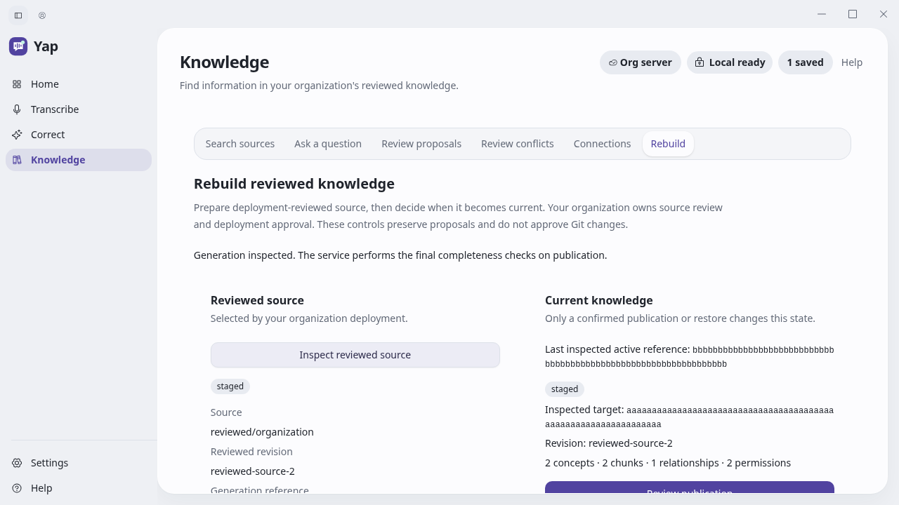
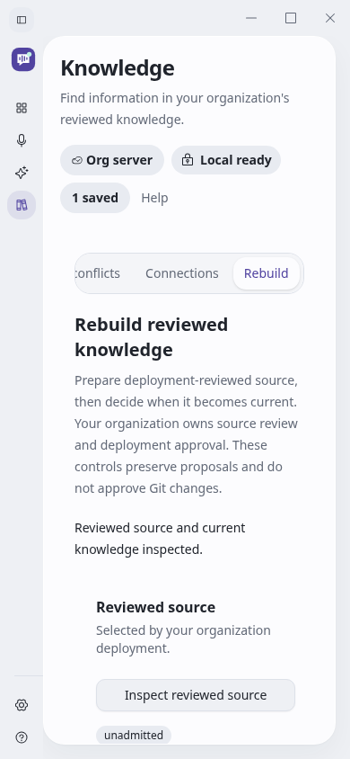

# Desktop reviewed-source rebuild verification

Owner: Grant McNatt. Date: 2026-10-04 (client date; raw execution logs use UTC).
Status: six of seven bounded software outcomes locally verified; reviewed
six-job green exact-head integration remains pending.

The original desktop had no Rebuild task, and its strict native health decoder
rejected the added service-presence capability. Original failing browser and
native assertions preceded implementation. Knowledge now exposes explicit
reviewed-source inspection, staging, configured embedding preparation,
generation inspection, expected-active publication and saved retained restore.
The organization still owns source review, deployment and provider configuration.

The native owner uses the selected authenticated connection and authority
revision, one bounded request at a time, strict versioned receipts and redacted
errors. Renderer fields cannot select source paths, endpoints, credentials,
principals or models. Required nullable active references distinguish missing
fields from null. All four counts and source revision bind a publication decision.
Dropped replies, timeouts, malformed write successes and post-dispatch identity
changes remain unconfirmed; explicit same-owner replay preserves the original
request. No automatic retry, model acquisition or remote cancellation is added.

Regression review caught staged receipts accepting an unadmitted status and
existing connection leases comparing a parsed trailing-slash origin with an
un-slashed configured origin. Focused original failures preceded corrections;
all eight existing Knowledge lease consumers now accept unchanged authority
while refusing changed connections. A real browser revocation regression exposed
cached private source details after a fresh denied response; those details now
clear immediately. Final build/Clippy checks also caught an unsupported
Object.hasOwn call and a nonminimal boolean expression; both were corrected
without changing the configured language target or weakening validation.

[Original observations](original-observations.txt) retain actual failure excerpts.

The extra local release suite initially failed its clean-checkout prerequisite
and a Windows Job Object assertion on Linux. The latter also failed on clean
main; its fixture now explicitly runs only on Windows, preserving that check
on its actual target. Final local contracts run from the committed clean checkout.

## Actual verification

- Full Linux native: 1,392 unit and 27 integration passes, no failures. Twelve
  declared ignores comprise eleven existing model/hardware fixtures and one
  explicitly owned SQL journey. That SQL journey ran separately with exactly
  one pass, zero failures and zero ignores.
- Actual built native client → authenticated real HTTP → owned digest-pinned
  PostgreSQL 17.11/pgvector 0.8.7: source, stage, complete embedding preparation,
  same-owner preparation replay without a second provider call, inspection,
  publication replay, permission-filtered Connections reads,
  immutable retained restore and foreign-owner refusal all pass. The fixture
  runs through `verification/run-native-knowledge-rebuild.py`; bearer identities
  and vectors are synthetic. Its initial incorrect `/health` test route was
  corrected to the existing `/v1/health`; that was a harness defect.
- All 161 required SQL cases in 26 modules pass without skips (46.546s).
  All 209 governed portable cases in 32 modules pass without skips (16.212s).
  Isolated full server discovery passes 1,672 with 158 declared exclusions,
  1,830 total (112.077s). Strict health/OpenAPI/examples checks pass all 17.
- Frontend units: 409 passes and two declared Windows-only skips, 411 total.
  Nine new browser journeys pass without skips, forced clicks or retries.
  Eleven related connection journeys also pass. Browser transport is an explicit
  native IPC fixture; the native/SQL check above verifies its separate boundary.
- Final production build and native Clippy pass; all 72 release contracts pass
  with five declared Windows-only skips (67 passes). Thirty documentation,
  license, provenance, population and workflow checks pass without skips.
- Responsive 1280×720 and 390×844 screens were inspected. The narrow journey
  checks keyboard operation, reduced motion and absence of horizontal overflow.
  These viewport captures use fictional source metadata, not organization data.

Reproduction uses the locked environment from the cloud runbook: `pnpm test`,
`pnpm build`, `pnpm test:e2e knowledge-rebuild.spec.ts`, locked Cargo tests and
Clippy, isolated server discovery and the required disposable PostgreSQL suite.
The native SQL driver requires an owned fixture DSN and the exact built Rust
unit-test binary; it refuses a zero-test success. Native TCP tests exercise real
headers/routes/body bounds, invalid receipts, connection loss and redacted refusals.

No real model quality, production Entra identity, enterprise network policy,
physical Windows input/audio/GPU or production promotion is qualified. The
Tauri request-owner lease tests and native-client SQL journey are distinct; this
is not a claim that a physical desktop window ran against production SQL.
The 64-chunk/256-KiB embedding boundary and deployment-trusted model metadata
remain as documented in the [operator contract](../../../specs/knowledge-publication.md).
The full project goal and remaining roadmap remain active.

## Hosted WDIO correction

[Run 560](https://github.com/ZoOtMcNoOt/yap/actions/runs/37265980798) at
`e17465b7` fails the required Windows WDIO exact-capabilities assertion. Its
actual native result is ready with `knowledgeRebuild: false`; the smoke
expectation omitted the newly required field. The private-server-ASR expected
shape had the same omission. Both expectations now include the required field.
[Original artifact observation](hosted-wdio-original.txt) retains the failed
head/job/artifact identity. This changes fixture expectations only. All six jobs
must be renewed on the correction before integration; the original run remains
a failed observation, not integration credit.

## Independent review corrections

[Review verification](review-verification.md) records the exact-head independent
review, original reproductions and corrections for identity-error clearing,
staging descriptor binding and activation descriptor binding through lost-reply
recovery. Run 561 passed all six jobs on the pre-correction head; the corrections
require a renewed reviewed six-job gate.
